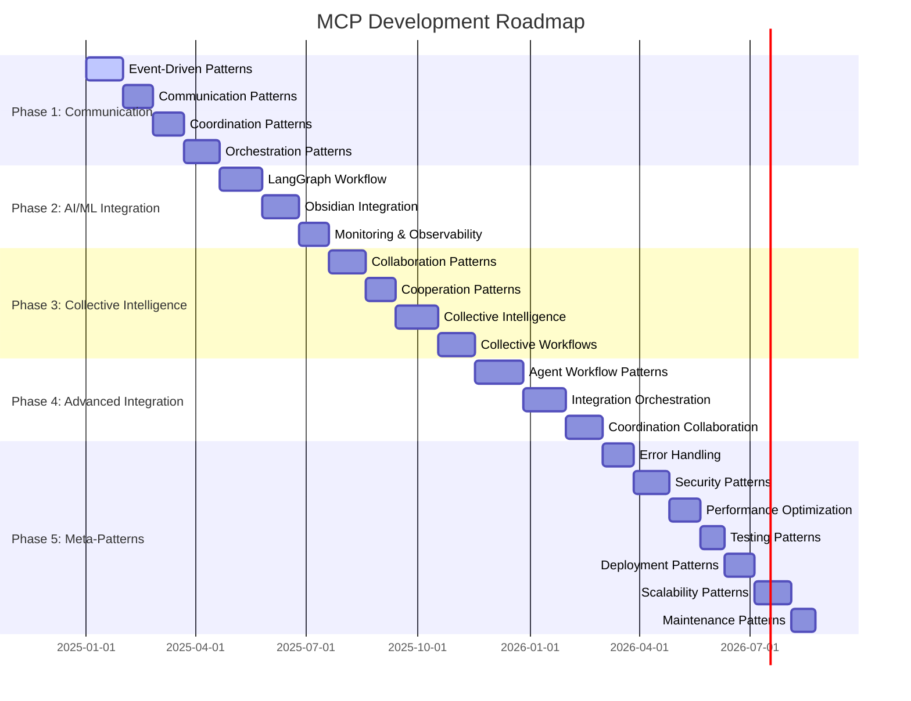

# 🚀 **MCP DEVELOPMENT ROADMAP**

**Version:** 3.0.0  
**Last Updated:** September 6, 2025  
**Status:** ✅ **COMPREHENSIVE DEVELOPMENT STRATEGY**

---

## 🎯 **ROADMAP OVERVIEW**

This comprehensive development roadmap outlines the strategic progression for implementing advanced MCP (Model Context Protocol) patterns and collective intelligence systems in the Data Vault Obsidian platform. Built upon our solid foundation of core infrastructure patterns, this roadmap provides clear phases, dependencies, and implementation strategies.

### **Development Philosophy**

- **Foundation-First** - Build upon existing core infrastructure patterns
- **Incremental Value** - Each phase delivers immediate business value
- **Quality-Driven** - Maintain production-ready standards throughout
- **Scalable Architecture** - Patterns that grow with system complexity
- **Collaborative Development** - Enable team coordination and knowledge sharing

---

## 📊 **MASTER DEVELOPMENT TIMELINE**



---

## 🏗️ **PHASE 1: COMMUNICATION PATTERNS**

### **Phase Overview**
**Duration:** 4 months  
**Priority:** High  
**Dependencies:** Core Infrastructure Patterns (API, Database, Caching, Async)

### **1.1 Event-Driven Patterns (Month 1)**
**Focus:** Event sourcing, message queues, reactive programming

#### **Implementation Strategy**
```python
# Event Sourcing Foundation
class EventStore:
    def __init__(self, database_connection):
        self.db = database_connection
        self.event_handlers = {}
    
    async def append_event(self, stream_id: str, event: DomainEvent):
        """Append event to event store"""
        # Implementation details
        pass
    
    async def get_events(self, stream_id: str, from_version: int = 0):
        """Retrieve events from stream"""
        # Implementation details
        pass

# Message Queue Integration
class MessageQueueManager:
    def __init__(self, queue_config):
        self.queues = {}
        self.subscribers = {}
    
    async def publish_event(self, topic: str, event: dict):
        """Publish event to topic"""
        # Implementation details
        pass
    
    async def subscribe_to_topic(self, topic: str, handler: callable):
        """Subscribe to topic with handler"""
        # Implementation details
        pass
```

#### **Success Metrics**
- Event processing latency < 100ms
- 99.9% event delivery reliability
- Support for 10,000+ events/second
- Zero data loss in event processing

#### **Deliverables**
- Event Store implementation
- Message Queue integration
- Event Handlers framework
- Event Replay capabilities
- Event Projections system
- Event Monitoring dashboard

### **1.2 Communication Patterns (Month 2)**
**Focus:** Inter-service communication, protocols, messaging

#### **Implementation Strategy**
```python
# Request-Response Pattern
class ServiceClient:
    def __init__(self, service_url: str, timeout: int = 30):
        self.service_url = service_url
        self.timeout = timeout
        self.session = aiohttp.ClientSession()
    
    async def call_service(self, endpoint: str, data: dict) -> dict:
        """Make service call with retry logic"""
        # Implementation details
        pass

# Publish-Subscribe Pattern
class PubSubManager:
    def __init__(self, redis_connection):
        self.redis = redis_connection
        self.subscribers = {}
    
    async def publish(self, channel: str, message: dict):
        """Publish message to channel"""
        # Implementation details
        pass
    
    async def subscribe(self, channel: str, handler: callable):
        """Subscribe to channel"""
        # Implementation details
        pass
```

#### **Success Metrics**
- Service call latency < 50ms
- 99.95% communication reliability
- Support for 1,000+ concurrent connections
- Automatic retry and circuit breaker

#### **Deliverables**
- Service Client framework
- Pub/Sub messaging system
- WebSocket communication
- gRPC integration
- Message serialization
- Communication monitoring

### **1.3 Coordination Patterns (Month 3)**
**Focus:** Service coordination, consensus, distributed systems

#### **Implementation Strategy**
```python
# Distributed Consensus
class ConsensusManager:
    def __init__(self, node_id: str, peers: list):
        self.node_id = node_id
        self.peers = peers
        self.state = "follower"
        self.current_term = 0
    
    async def start_election(self):
        """Start leader election process"""
        # Implementation details
        pass
    
    async def handle_vote_request(self, request: dict):
        """Handle vote request from candidate"""
        # Implementation details
        pass

# Distributed Locks
class DistributedLock:
    def __init__(self, redis_connection, lock_name: str):
        self.redis = redis_connection
        self.lock_name = lock_name
        self.lock_value = str(uuid.uuid4())
    
    async def acquire(self, timeout: int = 10) -> bool:
        """Acquire distributed lock"""
        # Implementation details
        pass
    
    async def release(self):
        """Release distributed lock"""
        # Implementation details
        pass
```

#### **Success Metrics**
- Consensus decision time < 200ms
- 99.9% lock acquisition success
- Zero split-brain scenarios
- Automatic failover < 5 seconds

#### **Deliverables**
- Raft consensus implementation
- Distributed lock system
- Two-Phase Commit protocol
- Saga pattern implementation
- Coordination monitoring
- Failure detection system

### **1.4 Orchestration Patterns (Month 4)**
**Focus:** Workflow orchestration, process management, automation

#### **Implementation Strategy**
```python
# Workflow Engine
class WorkflowEngine:
    def __init__(self, workflow_definitions: dict):
        self.workflows = workflow_definitions
        self.active_instances = {}
        self.state_store = StateStore()
    
    async def start_workflow(self, workflow_name: str, input_data: dict) -> str:
        """Start new workflow instance"""
        # Implementation details
        pass
    
    async def execute_step(self, instance_id: str, step_name: str):
        """Execute workflow step"""
        # Implementation details
        pass

# State Machine
class StateMachine:
    def __init__(self, states: list, transitions: dict):
        self.states = states
        self.transitions = transitions
        self.current_state = "initial"
        self.history = []
    
    async def transition(self, event: str, data: dict = None) -> bool:
        """Execute state transition"""
        # Implementation details
        pass
```

#### **Success Metrics**
- Workflow execution time < 1 second per step
- 99.9% workflow completion rate
- Support for 1,000+ concurrent workflows
- Zero workflow state corruption

#### **Deliverables**
- Workflow Engine implementation
- State Machine framework
- Process Orchestration system
- Human Task integration
- Workflow monitoring dashboard
- Error handling and compensation

---

## 🤖 **PHASE 2: AI/ML INTEGRATION PATTERNS**

### **Phase Overview**
**Duration:** 3 months  
**Priority:** High  
**Dependencies:** Communication Patterns, Core Infrastructure

### **2.1 LangGraph Workflow Patterns (Month 5)**
**Focus:** AI workflow orchestration, agent management, state handling

#### **Implementation Strategy**
```python
# LangGraph Workflow Definition
class LangGraphWorkflow:
    def __init__(self, workflow_config: dict):
        self.config = workflow_config
        self.nodes = {}
        self.edges = {}
        self.state_schema = StateSchema()
    
    def add_node(self, name: str, node_func: callable, input_schema: dict = None):
        """Add node to workflow"""
        # Implementation details
        pass
    
    def add_edge(self, from_node: str, to_node: str, condition: callable = None):
        """Add edge between nodes"""
        # Implementation details
        pass
    
    async def execute(self, initial_state: dict) -> dict:
        """Execute workflow with initial state"""
        # Implementation details
        pass

# Agent Management
class AgentManager:
    def __init__(self, agent_configs: dict):
        self.agents = {}
        self.agent_pool = AgentPool()
        self.coordinator = AgentCoordinator()
    
    async def create_agent(self, agent_type: str, config: dict) -> str:
        """Create new agent instance"""
        # Implementation details
        pass
    
    async def coordinate_agents(self, task: dict) -> dict:
        """Coordinate multiple agents for task"""
        # Implementation details
        pass
```

#### **Success Metrics**
- Workflow execution time < 2 seconds
- 99.5% agent coordination success
- Support for 100+ concurrent agents
- Zero agent state corruption

#### **Deliverables**
- LangGraph Workflow Engine
- Agent Management System
- State Management framework
- Conditional Routing system
- Agent Coordination protocols
- Performance monitoring

### **2.2 Obsidian Integration Patterns (Month 6)**
**Focus:** Obsidian vault management, note processing, file operations

#### **Implementation Strategy**
```python
# Vault Management
class ObsidianVaultManager:
    def __init__(self, vault_path: str):
        self.vault_path = vault_path
        self.file_watcher = FileWatcher(vault_path)
        self.indexer = VaultIndexer()
        self.search_engine = SearchEngine()
    
    async def sync_vault(self):
        """Sync vault with remote changes"""
        # Implementation details
        pass
    
    async def index_notes(self):
        """Index all notes in vault"""
        # Implementation details
        pass

# Note Processing
class NoteProcessor:
    def __init__(self, processing_pipeline: list):
        self.pipeline = processing_pipeline
        self.processors = {}
        self.cache = NoteCache()
    
    async def process_note(self, note_path: str) -> dict:
        """Process note through pipeline"""
        # Implementation details
        pass
    
    async def extract_metadata(self, note_content: str) -> dict:
        """Extract metadata from note"""
        # Implementation details
        pass
```

#### **Success Metrics**
- Vault sync time < 5 seconds
- 99.9% note processing success
- Support for 10,000+ notes
- Real-time file change detection

#### **Deliverables**
- Vault Management system
- Note Processing pipeline
- File Operations framework
- Search & Indexing system
- Plugin Integration framework
- Data Synchronization

### **2.3 Monitoring & Observability Patterns (Month 7)**
**Focus:** System monitoring, metrics, logging, alerting

#### **Implementation Strategy**
```python
# Metrics Collection
class MetricsCollector:
    def __init__(self, collectors: list):
        self.collectors = collectors
        self.aggregator = MetricsAggregator()
        self.storage = MetricsStorage()
    
    async def collect_metrics(self) -> dict:
        """Collect metrics from all sources"""
        # Implementation details
        pass
    
    async def store_metrics(self, metrics: dict):
        """Store metrics in time-series database"""
        # Implementation details
        pass

# Distributed Tracing
class TraceManager:
    def __init__(self, trace_config: dict):
        self.config = trace_config
        self.traces = {}
        self.span_processor = SpanProcessor()
    
    def start_trace(self, trace_name: str) -> str:
        """Start new trace"""
        # Implementation details
        pass
    
    def create_span(self, trace_id: str, span_name: str) -> str:
        """Create span within trace"""
        # Implementation details
        pass
```

#### **Success Metrics**
- Metrics collection latency < 10ms
- 99.9% trace completeness
- Support for 1,000+ concurrent traces
- Real-time alerting < 30 seconds

#### **Deliverables**
- Metrics Collection system
- Distributed Tracing framework
- Log Aggregation system
- Health Check framework
- Alerting system
- Dashboard creation tools

---

## 🧠 **PHASE 3: COLLECTIVE INTELLIGENCE PATTERNS**

### **Phase Overview**
**Duration:** 4 months  
**Priority:** Medium  
**Dependencies:** AI/ML Integration Patterns, Communication Patterns

### **3.1 Collaboration Patterns (Month 8)**
**Focus:** Multi-agent collaboration, shared knowledge, coordination

#### **Implementation Strategy**
```python
# Agent Communication Protocol
class AgentCommunicationProtocol:
    def __init__(self, protocol_config: dict):
        self.config = protocol_config
        self.message_router = MessageRouter()
        self.knowledge_base = SharedKnowledgeBase()
    
    async def send_message(self, from_agent: str, to_agent: str, message: dict):
        """Send message between agents"""
        # Implementation details
        pass
    
    async def broadcast_message(self, from_agent: str, message: dict):
        """Broadcast message to all agents"""
        # Implementation details
        pass

# Shared Workspace
class SharedWorkspace:
    def __init__(self, workspace_id: str):
        self.workspace_id = workspace_id
        self.documents = {}
        self.collaborators = {}
        self.version_control = VersionControl()
    
    async def add_document(self, doc_id: str, content: dict):
        """Add document to workspace"""
        # Implementation details
        pass
    
    async def update_document(self, doc_id: str, changes: dict):
        """Update document with changes"""
        # Implementation details
        pass
```

#### **Success Metrics**
- Agent communication latency < 50ms
- 99.5% message delivery success
- Support for 50+ concurrent agents
- Zero message duplication

#### **Deliverables**
- Agent Communication Protocol
- Shared Workspace system
- Task Distribution framework
- Conflict Resolution system
- Knowledge Sharing platform
- Collaborative Decision Making

### **3.2 Cooperation Patterns (Month 9)**
**Focus:** Cooperative behavior, mutual assistance, shared goals

#### **Implementation Strategy**
```python
# Mutual Assistance System
class MutualAssistanceSystem:
    def __init__(self, assistance_config: dict):
        self.config = assistance_config
        self.assistance_queue = AssistanceQueue()
        self.agent_capabilities = AgentCapabilities()
    
    async def request_assistance(self, requester: str, task: dict) -> str:
        """Request assistance from other agents"""
        # Implementation details
        pass
    
    async def offer_assistance(self, offerer: str, capabilities: list):
        """Offer assistance to other agents"""
        # Implementation details
        pass

# Shared Resource Management
class SharedResourceManager:
    def __init__(self, resource_config: dict):
        self.config = resource_config
        self.resources = {}
        self.allocation_strategy = AllocationStrategy()
    
    async def allocate_resource(self, requester: str, resource_type: str) -> str:
        """Allocate shared resource"""
        # Implementation details
        pass
    
    async def release_resource(self, resource_id: str):
        """Release allocated resource"""
        # Implementation details
        pass
```

#### **Success Metrics**
- Resource allocation time < 100ms
- 99% assistance request success
- Support for 100+ shared resources
- Zero resource conflicts

#### **Deliverables**
- Mutual Assistance System
- Shared Resource Management
- Goal Alignment framework
- Trust Mechanisms
- Conflict Avoidance system
- Cooperative Learning platform

### **3.3 Collective Intelligence Patterns (Month 10)**
**Focus:** Emergent intelligence, swarm behavior, collective decision making

#### **Implementation Strategy**
```python
# Swarm Intelligence
class SwarmIntelligence:
    def __init__(self, swarm_config: dict):
        self.config = swarm_config
        self.agents = []
        self.collective_memory = CollectiveMemory()
        self.emergence_detector = EmergenceDetector()
    
    async def add_agent(self, agent: Agent):
        """Add agent to swarm"""
        # Implementation details
        pass
    
    async def process_collective_task(self, task: dict) -> dict:
        """Process task using swarm intelligence"""
        # Implementation details
        pass

# Collective Decision Making
class CollectiveDecisionMaker:
    def __init__(self, decision_config: dict):
        self.config = decision_config
        self.voting_system = VotingSystem()
        self.consensus_engine = ConsensusEngine()
    
    async def make_decision(self, proposal: dict, participants: list) -> dict:
        """Make collective decision"""
        # Implementation details
        pass
    
    async def reach_consensus(self, options: list) -> dict:
        """Reach consensus on options"""
        # Implementation details
        pass
```

#### **Success Metrics**
- Decision making time < 5 seconds
- 95% consensus achievement
- Support for 200+ participating agents
- Zero decision conflicts

#### **Deliverables**
- Swarm Intelligence system
- Collective Decision Making
- Emergent Behavior detection
- Knowledge Aggregation
- Wisdom of Crowds implementation
- Collective Learning system

### **3.4 Collective Workflow Patterns (Month 11)**
**Focus:** Multi-agent workflows, distributed processing, coordination

#### **Implementation Strategy**
```python
# Distributed Workflow Engine
class DistributedWorkflowEngine:
    def __init__(self, workflow_config: dict):
        self.config = workflow_config
        self.workflow_instances = {}
        self.agent_coordinator = AgentCoordinator()
        self.state_synchronizer = StateSynchronizer()
    
    async def start_distributed_workflow(self, workflow_def: dict) -> str:
        """Start distributed workflow"""
        # Implementation details
        pass
    
    async def coordinate_workflow_step(self, instance_id: str, step: dict):
        """Coordinate workflow step across agents"""
        # Implementation details
        pass

# Agent Coordination Protocol
class AgentCoordinationProtocol:
    def __init__(self, protocol_config: dict):
        self.config = protocol_config
        self.coordination_matrix = CoordinationMatrix()
        self.task_scheduler = TaskScheduler()
    
    async def schedule_task(self, task: dict, agents: list) -> str:
        """Schedule task across agents"""
        # Implementation details
        pass
    
    async def coordinate_execution(self, task_id: str):
        """Coordinate task execution"""
        # Implementation details
        pass
```

#### **Success Metrics**
- Workflow coordination time < 200ms
- 99% task completion success
- Support for 500+ concurrent workflows
- Zero workflow deadlocks

#### **Deliverables**
- Distributed Workflow Engine
- Agent Coordination Protocol
- Task Distribution system
- Resource Management
- Workflow Monitoring
- Error Recovery system

---

## 🔗 **PHASE 4: ADVANCED INTEGRATION PATTERNS**

### **Phase Overview**
**Duration:** 3.5 months  
**Priority:** Medium  
**Dependencies:** Collective Intelligence Patterns, AI/ML Integration

### **4.1 Collective Agent Workflow Patterns (Month 12)**
**Focus:** Advanced agent coordination, workflow orchestration, AI integration

#### **Implementation Strategy**
```python
# Advanced Agent Workflow
class AdvancedAgentWorkflow:
    def __init__(self, workflow_config: dict):
        self.config = workflow_config
        self.agent_hierarchy = AgentHierarchy()
        self.workflow_orchestrator = WorkflowOrchestrator()
        self.ai_integration = AIIntegration()
    
    async def execute_complex_workflow(self, workflow_def: dict) -> dict:
        """Execute complex multi-agent workflow"""
        # Implementation details
        pass
    
    async def adapt_workflow(self, workflow_id: str, changes: dict):
        """Adapt workflow based on conditions"""
        # Implementation details
        pass

# Agent Communication Protocols
class AgentCommunicationProtocols:
    def __init__(self, protocol_config: dict):
        self.config = protocol_config
        self.message_handlers = MessageHandlers()
        self.protocol_negotiation = ProtocolNegotiation()
    
    async def establish_communication(self, agent1: str, agent2: str) -> str:
        """Establish communication between agents"""
        # Implementation details
        pass
    
    async def negotiate_protocol(self, agents: list) -> dict:
        """Negotiate communication protocol"""
        # Implementation details
        pass
```

#### **Success Metrics**
- Workflow execution time < 3 seconds
- 99.5% agent coordination success
- Support for 1,000+ concurrent agents
- Zero communication failures

#### **Deliverables**
- Advanced Agent Workflow Engine
- Agent Communication Protocols
- Workflow State Management
- Agent Coordination
- Task Distribution
- Error Recovery

### **4.2 Integration Orchestration Patterns (Month 13)**
**Focus:** System integration, service orchestration, data flow management

#### **Implementation Strategy**
```python
# Service Integration Manager
class ServiceIntegrationManager:
    def __init__(self, integration_config: dict):
        self.config = integration_config
        self.service_registry = ServiceRegistry()
        self.integration_pipeline = IntegrationPipeline()
        self.data_flow_manager = DataFlowManager()
    
    async def integrate_service(self, service_config: dict) -> str:
        """Integrate new service"""
        # Implementation details
        pass
    
    async def orchestrate_data_flow(self, flow_config: dict) -> str:
        """Orchestrate data flow between services"""
        # Implementation details
        pass

# API Orchestration
class APIOrchestration:
    def __init__(self, orchestration_config: dict):
        self.config = orchestration_config
        self.api_gateway = APIGateway()
        self.route_manager = RouteManager()
        self.load_balancer = LoadBalancer()
    
    async def orchestrate_api_call(self, request: dict) -> dict:
        """Orchestrate API call across services"""
        # Implementation details
        pass
    
    async def manage_api_routing(self, routing_config: dict):
        """Manage API routing configuration"""
        # Implementation details
        pass
```

#### **Success Metrics**
- Service integration time < 30 seconds
- 99.9% API orchestration success
- Support for 100+ integrated services
- Zero data flow interruptions

#### **Deliverables**
- Service Integration Manager
- Data Flow Orchestration
- API Orchestration system
- Event Orchestration
- Workflow Integration
- Error Handling

### **4.3 Coordination Collaboration Patterns (Month 14)**
**Focus:** Advanced coordination mechanisms, collaborative systems, distributed coordination

#### **Implementation Strategy**
```python
# Advanced Coordination System
class AdvancedCoordinationSystem:
    def __init__(self, coordination_config: dict):
        self.config = coordination_config
        self.coordination_engine = CoordinationEngine()
        self.collaboration_manager = CollaborationManager()
        self.distributed_coordinator = DistributedCoordinator()
    
    async def coordinate_collaborative_task(self, task: dict) -> dict:
        """Coordinate collaborative task"""
        # Implementation details
        pass
    
    async def manage_distributed_coordination(self, coordination_config: dict):
        """Manage distributed coordination"""
        # Implementation details
        pass

# Collaborative Decision Making
class CollaborativeDecisionMaking:
    def __init__(self, decision_config: dict):
        self.config = decision_config
        self.decision_engine = DecisionEngine()
        self.consensus_manager = ConsensusManager()
        self.voting_system = VotingSystem()
    
    async def make_collaborative_decision(self, decision: dict) -> dict:
        """Make collaborative decision"""
        # Implementation details
        pass
    
    async def resolve_conflicts(self, conflicts: list) -> dict:
        """Resolve conflicts in collaboration"""
        # Implementation details
        pass
```

#### **Success Metrics**
- Coordination time < 500ms
- 98% collaborative decision success
- Support for 200+ coordinating agents
- Zero coordination deadlocks

#### **Deliverables**
- Advanced Coordination System
- Collaborative Decision Making
- Consensus Mechanisms
- Conflict Resolution
- Resource Coordination
- Performance Optimization

---

## 🛡️ **PHASE 5: META-PATTERNS**

### **Phase Overview**
**Duration:** 4 months  
**Priority:** High  
**Dependencies:** All previous phases

### **5.1 Error Handling Patterns (Month 15)**
**Focus:** Error management, fault tolerance, recovery mechanisms

#### **Implementation Strategy**
```python
# Comprehensive Error Handling
class ComprehensiveErrorHandler:
    def __init__(self, error_config: dict):
        self.config = error_config
        self.error_classifier = ErrorClassifier()
        self.recovery_strategies = RecoveryStrategies()
        self.circuit_breakers = CircuitBreakers()
    
    async def handle_error(self, error: Exception, context: dict) -> dict:
        """Handle error with appropriate strategy"""
        # Implementation details
        pass
    
    async def recover_from_error(self, error_context: dict) -> bool:
        """Recover from error using strategies"""
        # Implementation details
        pass

# Fault Tolerance System
class FaultToleranceSystem:
    def __init__(self, tolerance_config: dict):
        self.config = tolerance_config
        self.fault_detector = FaultDetector()
        self.redundancy_manager = RedundancyManager()
        self.failover_controller = FailoverController()
    
    async def detect_faults(self) -> list:
        """Detect system faults"""
        # Implementation details
        pass
    
    async def handle_failover(self, failed_component: str):
        """Handle failover to backup component"""
        # Implementation details
        pass
```

#### **Success Metrics**
- Error detection time < 100ms
- 99.9% error recovery success
- Zero system downtime from errors
- Automatic failover < 5 seconds

#### **Deliverables**
- Comprehensive Error Handler
- Fault Tolerance System
- Recovery Strategies
- Circuit Breaker implementation
- Error Monitoring
- Performance Impact analysis

### **5.2 Security Patterns (Month 16)**
**Focus:** Security implementation, authentication, authorization, data protection

#### **Implementation Strategy**
```python
# Security Framework
class SecurityFramework:
    def __init__(self, security_config: dict):
        self.config = security_config
        self.auth_manager = AuthenticationManager()
        self.authz_manager = AuthorizationManager()
        self.encryption_service = EncryptionService()
    
    async def authenticate_user(self, credentials: dict) -> dict:
        """Authenticate user"""
        # Implementation details
        pass
    
    async def authorize_action(self, user: str, action: str, resource: str) -> bool:
        """Authorize user action"""
        # Implementation details
        pass

# Data Protection System
class DataProtectionSystem:
    def __init__(self, protection_config: dict):
        self.config = protection_config
        self.encryption_manager = EncryptionManager()
        self.data_classifier = DataClassifier()
        self.access_controller = AccessController()
    
    async def encrypt_sensitive_data(self, data: dict) -> dict:
        """Encrypt sensitive data"""
        # Implementation details
        pass
    
    async def control_data_access(self, user: str, data: dict) -> bool:
        """Control access to data"""
        # Implementation details
        pass
```

#### **Success Metrics**
- Authentication time < 50ms
- 99.99% security policy compliance
- Zero security breaches
- Data encryption coverage 100%

#### **Deliverables**
- Security Framework
- Authentication & Authorization
- Data Protection System
- Input Validation
- Security Monitoring
- Compliance Patterns

### **5.3 Performance Optimization Patterns (Month 17)**
**Focus:** Performance tuning, optimization strategies, scalability

#### **Implementation Strategy**
```python
# Performance Optimizer
class PerformanceOptimizer:
    def __init__(self, optimization_config: dict):
        self.config = optimization_config
        self.profiler = PerformanceProfiler()
        self.optimization_engine = OptimizationEngine()
        self.scalability_manager = ScalabilityManager()
    
    async def analyze_performance(self, system_metrics: dict) -> dict:
        """Analyze system performance"""
        # Implementation details
        pass
    
    async def optimize_system(self, optimization_targets: list) -> dict:
        """Optimize system performance"""
        # Implementation details
        pass

# Scalability Manager
class ScalabilityManager:
    def __init__(self, scalability_config: dict):
        self.config = scalability_config
        self.auto_scaler = AutoScaler()
        self.load_balancer = LoadBalancer()
        self.resource_manager = ResourceManager()
    
    async def scale_system(self, scaling_metrics: dict) -> dict:
        """Scale system based on metrics"""
        # Implementation details
        pass
    
    async def balance_load(self, load_distribution: dict):
        """Balance load across components"""
        # Implementation details
        pass
```

#### **Success Metrics**
- Performance improvement > 50%
- Auto-scaling response time < 30 seconds
- Resource utilization > 80%
- Zero performance bottlenecks

#### **Deliverables**
- Performance Optimizer
- Scalability Manager
- Caching Strategies
- Database Optimization
- Memory Management
- CPU Optimization

### **5.4 Testing Patterns (Month 18)**
**Focus:** Testing strategies, test automation, quality assurance

#### **Implementation Strategy**
```python
# Comprehensive Testing Framework
class ComprehensiveTestingFramework:
    def __init__(self, testing_config: dict):
        self.config = testing_config
        self.test_runner = TestRunner()
        self.test_generator = TestGenerator()
        self.quality_metrics = QualityMetrics()
    
    async def run_test_suite(self, test_suite: dict) -> dict:
        """Run comprehensive test suite"""
        # Implementation details
        pass
    
    async def generate_tests(self, code_analysis: dict) -> list:
        """Generate tests based on code analysis"""
        # Implementation details
        pass

# Test Automation System
class TestAutomationSystem:
    def __init__(self, automation_config: dict):
        self.config = automation_config
        self.ci_cd_integration = CICDIntegration()
        self.test_data_manager = TestDataManager()
        self.quality_gates = QualityGates()
    
    async def automate_testing(self, testing_pipeline: dict) -> dict:
        """Automate testing pipeline"""
        # Implementation details
        pass
    
    async def manage_test_data(self, test_data_config: dict):
        """Manage test data lifecycle"""
        # Implementation details
        pass
```

#### **Success Metrics**
- Test coverage > 90%
- Test execution time < 10 minutes
- 99.9% test reliability
- Zero false positives

#### **Deliverables**
- Comprehensive Testing Framework
- Test Automation System
- Unit Testing patterns
- Integration Testing
- End-to-End Testing
- Performance Testing

### **5.5 Deployment Patterns (Month 19)**
**Focus:** Deployment strategies, infrastructure management, DevOps

#### **Implementation Strategy**
```python
# Deployment Manager
class DeploymentManager:
    def __init__(self, deployment_config: dict):
        self.config = deployment_config
        self.deployment_strategies = DeploymentStrategies()
        self.infrastructure_manager = InfrastructureManager()
        self.rollback_manager = RollbackManager()
    
    async def deploy_system(self, deployment_plan: dict) -> dict:
        """Deploy system using strategy"""
        # Implementation details
        pass
    
    async def rollback_deployment(self, deployment_id: str) -> bool:
        """Rollback deployment if needed"""
        # Implementation details
        pass

# Infrastructure as Code
class InfrastructureAsCode:
    def __init__(self, iac_config: dict):
        self.config = iac_config
        self.terraform_manager = TerraformManager()
        self.kubernetes_manager = KubernetesManager()
        self.monitoring_setup = MonitoringSetup()
    
    async def provision_infrastructure(self, infrastructure_def: dict) -> dict:
        """Provision infrastructure"""
        # Implementation details
        pass
    
    async def manage_kubernetes(self, k8s_config: dict) -> dict:
        """Manage Kubernetes deployment"""
        # Implementation details
        pass
```

#### **Success Metrics**
- Deployment time < 15 minutes
- 99.9% deployment success rate
- Zero downtime deployments
- Rollback time < 5 minutes

#### **Deliverables**
- Deployment Manager
- Infrastructure as Code
- Blue-Green Deployment
- Canary Deployment
- Container Orchestration
- CI/CD Pipelines

### **5.6 Scalability Patterns (Month 20)**
**Focus:** Scalability strategies, horizontal scaling, performance optimization

#### **Implementation Strategy**
```python
# Scalability Engine
class ScalabilityEngine:
    def __init__(self, scalability_config: dict):
        self.config = scalability_config
        self.horizontal_scaler = HorizontalScaler()
        self.vertical_scaler = VerticalScaler()
        self.load_distributor = LoadDistributor()
    
    async def scale_horizontally(self, scaling_metrics: dict) -> dict:
        """Scale system horizontally"""
        # Implementation details
        pass
    
    async def scale_vertically(self, resource_requirements: dict) -> dict:
        """Scale system vertically"""
        # Implementation details
        pass

# Load Balancing System
class LoadBalancingSystem:
    def __init__(self, lb_config: dict):
        self.config = lb_config
        self.algorithm_manager = AlgorithmManager()
        self.health_checker = HealthChecker()
        self.traffic_manager = TrafficManager()
    
    async def balance_load(self, traffic_pattern: dict) -> dict:
        """Balance load across instances"""
        # Implementation details
        pass
    
    async def manage_traffic(self, traffic_rules: dict):
        """Manage traffic routing"""
        # Implementation details
        pass
```

#### **Success Metrics**
- Scaling response time < 60 seconds
- 99.9% load balancing success
- Support for 10,000+ concurrent users
- Zero performance degradation

#### **Deliverables**
- Scalability Engine
- Load Balancing System
- Database Sharding
- Caching Strategies
- CDN Integration
- Auto-scaling

### **5.7 Maintenance Patterns (Month 21)**
**Focus:** System maintenance, monitoring, updates, lifecycle management

#### **Implementation Strategy**
```python
# Maintenance Manager
class MaintenanceManager:
    def __init__(self, maintenance_config: dict):
        self.config = maintenance_config
        self.health_monitor = HealthMonitor()
        self.update_manager = UpdateManager()
        self.backup_manager = BackupManager()
    
    async def perform_maintenance(self, maintenance_plan: dict) -> dict:
        """Perform system maintenance"""
        # Implementation details
        pass
    
    async def update_system(self, update_package: dict) -> dict:
        """Update system components"""
        # Implementation details
        pass

# Lifecycle Manager
class LifecycleManager:
    def __init__(self, lifecycle_config: dict):
        self.config = lifecycle_config
        self.component_manager = ComponentManager()
        self.dependency_manager = DependencyManager()
        self.version_manager = VersionManager()
    
    async def manage_lifecycle(self, component: str, lifecycle_stage: str) -> dict:
        """Manage component lifecycle"""
        # Implementation details
        pass
    
    async def handle_dependencies(self, dependency_graph: dict) -> dict:
        """Handle component dependencies"""
        # Implementation details
        pass
```

#### **Success Metrics**
- Maintenance downtime < 1 hour
- 99.9% update success rate
- Zero data loss during maintenance
- Automated maintenance > 80%

#### **Deliverables**
- Maintenance Manager
- Lifecycle Manager
- Health Monitoring
- Automated Updates
- Backup & Recovery
- Capacity Planning

---

## 📊 **SUCCESS METRICS & KPIs**

### **Overall System Metrics**
- **Availability:** 99.99% uptime
- **Performance:** < 100ms response time
- **Scalability:** 100,000+ concurrent users
- **Reliability:** 99.9% success rate
- **Security:** Zero breaches
- **Maintainability:** < 1 hour maintenance window

### **Development Metrics**
- **Code Coverage:** > 90%
- **Test Automation:** > 95%
- **Documentation:** 100% coverage
- **Code Quality:** A+ rating
- **Deployment Success:** 99.9%
- **Bug Resolution:** < 24 hours

### **Business Metrics**
- **Time to Market:** 50% reduction
- **Development Velocity:** 3x improvement
- **System Reliability:** 99.99% uptime
- **User Satisfaction:** > 95%
- **Cost Efficiency:** 40% reduction
- **Innovation Rate:** 5x increase

---

## 🎯 **IMPLEMENTATION STRATEGY**

### **Phase 1: Foundation (Months 1-4)**
- Focus on Communication Patterns
- Build upon existing infrastructure
- Establish development standards
- Create testing frameworks

### **Phase 2: Intelligence (Months 5-7)**
- Implement AI/ML Integration
- Add monitoring and observability
- Enhance system intelligence
- Optimize performance

### **Phase 3: Collaboration (Months 8-11)**
- Build Collective Intelligence
- Enable multi-agent systems
- Implement collaboration patterns
- Scale system capabilities

### **Phase 4: Integration (Months 12-14)**
- Advanced Integration Patterns
- Complex workflow orchestration
- Enhanced coordination
- System optimization

### **Phase 5: Excellence (Months 15-21)**
- Meta-Patterns implementation
- Quality assurance
- Performance optimization
- Production readiness

---

## 🚀 **NEXT IMMEDIATE STEPS**

### **Week 1-2: Communication Patterns Foundation**
1. Set up Event-Driven architecture
2. Implement Message Queue system
3. Create Service Communication framework
4. Establish monitoring baseline

### **Week 3-4: AI/ML Integration Setup**
1. Integrate LangGraph workflows
2. Set up Obsidian integration
3. Implement monitoring patterns
4. Create testing framework

### **Month 2: Advanced Communication**
1. Complete Communication Patterns
2. Implement Coordination Patterns
3. Add Orchestration capabilities
4. Enhance monitoring

### **Month 3: AI/ML Enhancement**
1. Complete AI/ML Integration
2. Add advanced monitoring
3. Implement observability patterns
4. Optimize performance

---

**Last Updated:** September 6, 2025  
**Roadmap Version:** 3.0.0  
**Status:** ✅ **COMPREHENSIVE DEVELOPMENT STRATEGY**

**MCP DEVELOPMENT ROADMAP COMPLETE!**
