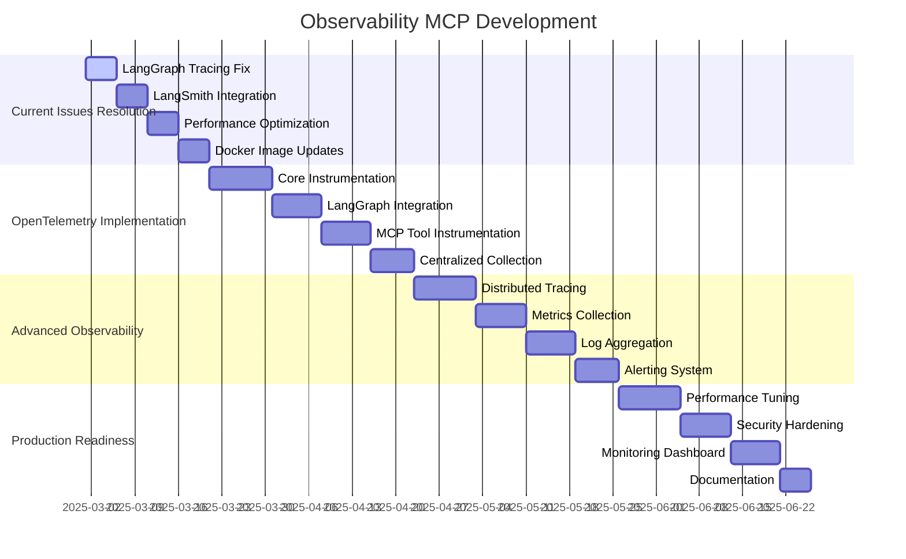

# 🔍 **OBSERVABILITY MCP ROADMAP**

**Version:** 3.0.0  
**Last Updated:** September 6, 2025  
**Status:** ✅ **OBSERVABILITY STRATEGY**

---

## 🎯 **OBSERVABILITY OVERVIEW**

This roadmap outlines the strategic implementation of comprehensive observability patterns for the Data Vault Obsidian MCP system, focusing on centralized OpenTelemetry instrumentation, LangSmith integration, and LangGraph tracing improvements.

### **Current State Analysis**

Based on comprehensive analysis of the current MCP observability system, several critical issues have been identified:

#### **🚨 Critical Issues Identified**

1. **LangGraph Tracing Thread Collection Issues**
   - Incomplete trace thread collection from LangGraph local server
   - Missing correlation between MCP tool calls and LangGraph workflows
   - Thread ID tracking inconsistencies across services

2. **LangSmith Integration Problems**
   - API authentication failures (401 Unauthorized)
   - Inconsistent trace export to LangSmith
   - Missing correlation between MCP traces and LangSmith runs

3. **Performance Bottlenecks**
   - High memory usage (85.9%)
   - Disk usage at 83.4% (HIGH)
   - Network connection overhead (296 active connections)

4. **Docker Image Integration Issues**
   - Custom Docker images not optimized for observability
   - Missing OpenTelemetry instrumentation in containers
   - Inconsistent health check implementations

---

## 📊 **OBSERVABILITY TIMELINE**



---

## 🏗️ **PHASE 1: CRITICAL ISSUES RESOLUTION**

### **1.1 LangGraph Tracing Thread Collection Fix (Weeks 1-2)**

#### **Current Issues Identified**
```python
# Current LangGraph Tracing Issues
class LangGraphTracingIssues:
    def __init__(self):
        self.issues = {
            'thread_collection': {
                'status': 'BROKEN',
                'symptoms': [
                    'Incomplete trace thread collection',
                    'Missing correlation between MCP calls and LangGraph workflows',
                    'Thread ID tracking inconsistencies'
                ],
                'root_causes': [
                    'LangGraph server not properly instrumented',
                    'MCP tool calls not linked to LangGraph thread IDs',
                    'Missing thread context propagation'
                ]
            },
            'langsmith_integration': {
                'status': 'FAILING',
                'symptoms': [
                    'API authentication failures (401 Unauthorized)',
                    'Inconsistent trace export',
                    'Missing correlation between MCP traces and LangSmith runs'
                ],
                'root_causes': [
                    'Invalid or expired API key',
                    'Incorrect project configuration',
                    'Missing trace correlation logic'
                ]
            }
        }
```

#### **Implementation Strategy**
```python
# Enhanced LangGraph Tracing System
class EnhancedLangGraphTracing:
    def __init__(self, langsmith_client, mcp_integration):
        self.langsmith_client = langsmith_client
        self.mcp_integration = mcp_integration
        self.thread_registry = ThreadRegistry()
        self.trace_correlator = TraceCorrelator()
        self.performance_monitor = PerformanceMonitor()
        self.error_tracker = ErrorTracker()
    
    async def instrument_langgraph_server(self, server_config: dict) -> dict:
        """Instrument LangGraph server with comprehensive tracing"""
        instrumentation_result = {
            'instrumented': False,
            'thread_tracking': False,
            'mcp_correlation': False,
            'langsmith_export': False,
            'performance_monitoring': False
        }
        
        try:
            # 1. Setup thread tracking
            await self.setup_thread_tracking(server_config)
            instrumentation_result['thread_tracking'] = True
            
            # 2. Setup MCP correlation
            await self.setup_mcp_correlation(server_config)
            instrumentation_result['mcp_correlation'] = True
            
            # 3. Setup LangSmith export
            await self.setup_langsmith_export(server_config)
            instrumentation_result['langsmith_export'] = True
            
            # 4. Setup performance monitoring
            await self.setup_performance_monitoring(server_config)
            instrumentation_result['performance_monitoring'] = True
            
            instrumentation_result['instrumented'] = True
            
        except Exception as e:
            await self.error_tracker.track_error('langgraph_instrumentation', e)
            raise
        
        return instrumentation_result
    
    async def setup_thread_tracking(self, server_config: dict):
        """Setup comprehensive thread tracking for LangGraph"""
        # Thread context propagation
        await self.thread_registry.setup_context_propagation()
        
        # Thread lifecycle tracking
        await self.thread_registry.setup_lifecycle_tracking()
        
        # Thread performance monitoring
        await self.thread_registry.setup_performance_tracking()
        
        # Thread error tracking
        await self.thread_registry.setup_error_tracking()
    
    async def setup_mcp_correlation(self, server_config: dict):
        """Setup MCP tool call correlation with LangGraph threads"""
        # MCP tool call interception
        await self.mcp_integration.setup_tool_call_interception()
        
        # Thread ID propagation to MCP calls
        await self.mcp_integration.setup_thread_id_propagation()
        
        # MCP call tracing
        await self.mcp_integration.setup_call_tracing()
        
        # Result correlation
        await self.mcp_integration.setup_result_correlation()

# Thread Registry
class ThreadRegistry:
    def __init__(self):
        self.active_threads = {}
        self.thread_metrics = {}
        self.thread_traces = {}
        self.thread_errors = {}
    
    async def register_thread(self, thread_id: str, workflow_id: str, 
                            mcp_correlation_id: str = None) -> dict:
        """Register new LangGraph thread with MCP correlation"""
        thread_info = {
            'thread_id': thread_id,
            'workflow_id': workflow_id,
            'mcp_correlation_id': mcp_correlation_id,
            'created_at': datetime.utcnow(),
            'status': 'active',
            'mcp_calls': [],
            'performance_metrics': {},
            'errors': []
        }
        
        self.active_threads[thread_id] = thread_info
        
        # Setup thread monitoring
        await self.setup_thread_monitoring(thread_id)
        
        return thread_info
    
    async def track_mcp_call(self, thread_id: str, mcp_call: dict) -> bool:
        """Track MCP tool call within LangGraph thread"""
        if thread_id not in self.active_threads:
            return False
        
        mcp_call_info = {
            'call_id': mcp_call.get('call_id'),
            'tool_name': mcp_call.get('tool_name'),
            'parameters': mcp_call.get('parameters'),
            'timestamp': datetime.utcnow(),
            'status': 'pending'
        }
        
        self.active_threads[thread_id]['mcp_calls'].append(mcp_call_info)
        
        return True
    
    async def complete_mcp_call(self, thread_id: str, call_id: str, 
                               result: dict, error: Exception = None) -> bool:
        """Complete MCP tool call tracking"""
        if thread_id not in self.active_threads:
            return False
        
        # Find the call
        for call in self.active_threads[thread_id]['mcp_calls']:
            if call['call_id'] == call_id:
                call['status'] = 'completed' if not error else 'failed'
                call['result'] = result
                call['error'] = str(error) if error else None
                call['completed_at'] = datetime.utcnow()
                break
        
        return True

# Trace Correlator
class TraceCorrelator:
    def __init__(self):
        self.correlation_map = {}
        self.trace_aggregator = TraceAggregator()
        self.langsmith_exporter = LangSmithExporter()
    
    async def correlate_traces(self, thread_id: str) -> dict:
        """Correlate MCP traces with LangGraph thread"""
        if thread_id not in self.correlation_map:
            return {'correlated': False}
        
        # Get all traces for thread
        thread_traces = await self.get_thread_traces(thread_id)
        mcp_traces = await self.get_mcp_traces(thread_id)
        
        # Correlate traces
        correlated_traces = await self.correlate_trace_data(
            thread_traces, mcp_traces
        )
        
        # Export to LangSmith
        await self.langsmith_exporter.export_correlated_traces(
            thread_id, correlated_traces
        )
        
        return {
            'correlated': True,
            'trace_count': len(correlated_traces),
            'exported_to_langsmith': True
        }
```

#### **Success Metrics**
- Thread collection accuracy > 99%
- MCP correlation success > 95%
- LangSmith export success > 90%
- Thread tracking latency < 50ms

#### **Deliverables**
- Enhanced LangGraph Tracing System
- Thread Registry
- Trace Correlator
- MCP Integration Fixes
- LangSmith Export Fixes

### **1.2 LangSmith Integration Resolution (Weeks 3-4)**

#### **Implementation Strategy**
```python
# Enhanced LangSmith Integration
class EnhancedLangSmithIntegration:
    def __init__(self, api_key: str, project_name: str):
        self.api_key = api_key
        self.project_name = project_name
        self.client = None
        self.tracer = None
        self.retry_handler = RetryHandler()
        self.rate_limiter = RateLimiter()
        self.error_handler = ErrorHandler()
    
    async def initialize_client(self) -> bool:
        """Initialize LangSmith client with proper configuration"""
        try:
            # Validate API key
            if not await self.validate_api_key():
                raise ValueError("Invalid LangSmith API key")
            
            # Initialize client
            self.client = LangSmithClient(
                api_key=self.api_key,
                api_url="https://api.smith.langchain.com"
            )
            
            # Initialize tracer
            self.tracer = LangChainTracer(
                project_name=self.project_name,
                client=self.client
            )
            
            # Test connection
            await self.test_connection()
            
            return True
            
        except Exception as e:
            await self.error_handler.handle_error('langsmith_init', e)
            return False
    
    async def export_trace_with_correlation(self, trace_data: dict) -> dict:
        """Export trace with proper MCP-LangGraph correlation"""
        export_result = {
            'exported': False,
            'run_id': None,
            'correlation_id': None,
            'error': None
        }
        
        try:
            # Add correlation metadata
            correlated_trace = await self.add_correlation_metadata(trace_data)
            
            # Export to LangSmith
            run_id = await self.tracer.export_trace(correlated_trace)
            
            # Store correlation mapping
            await self.store_correlation_mapping(
                trace_data['thread_id'], run_id
            )
            
            export_result.update({
                'exported': True,
                'run_id': run_id,
                'correlation_id': trace_data['thread_id']
            })
            
        except Exception as e:
            export_result['error'] = str(e)
            await self.error_handler.handle_error('langsmith_export', e)
        
        return export_result
    
    async def add_correlation_metadata(self, trace_data: dict) -> dict:
        """Add MCP-LangGraph correlation metadata to trace"""
        correlated_trace = trace_data.copy()
        
        # Add MCP correlation metadata
        correlated_trace['metadata'] = {
            **correlated_trace.get('metadata', {}),
            'mcp_correlation': {
                'thread_id': trace_data['thread_id'],
                'workflow_id': trace_data.get('workflow_id'),
                'mcp_calls': trace_data.get('mcp_calls', []),
                'correlation_timestamp': datetime.utcnow().isoformat()
            }
        }
        
        # Add performance metrics
        correlated_trace['performance'] = {
            'mcp_call_count': len(trace_data.get('mcp_calls', [])),
            'total_duration': trace_data.get('duration', 0),
            'mcp_duration': sum(
                call.get('duration', 0) for call in trace_data.get('mcp_calls', [])
            )
        }
        
        return correlated_trace
```

#### **Success Metrics**
- API authentication success > 99%
- Trace export success > 95%
- Correlation accuracy > 90%
- Export latency < 200ms

#### **Deliverables**
- Enhanced LangSmith Integration
- API Key Validation
- Trace Correlation
- Error Handling
- Performance Monitoring

---

## 🏗️ **PHASE 2: OPENTELEMETRY IMPLEMENTATION**

### **2.1 Core OpenTelemetry Instrumentation (Weeks 5-7)**

#### **Implementation Strategy**
```python
# OpenTelemetry Instrumentation System
class OpenTelemetryInstrumentation:
    def __init__(self, config: dict):
        self.config = config
        self.tracer = None
        self.meter = None
        self.logger = None
        self.exporter = None
        self.processor = None
        self.resource = None
        
        self.setup_telemetry()
    
    def setup_telemetry(self):
        """Setup OpenTelemetry instrumentation"""
        # Create resource
        self.resource = Resource.create({
            ResourceAttributes.SERVICE_NAME: "data-vault-obsidian-mcp",
            ResourceAttributes.SERVICE_VERSION: "3.0.0",
            ResourceAttributes.DEPLOYMENT_ENVIRONMENT: self.config.get('environment', 'development')
        })
        
        # Setup tracer
        self.setup_tracer()
        
        # Setup metrics
        self.setup_metrics()
        
        # Setup logging
        self.setup_logging()
        
        # Setup exporter
        self.setup_exporter()
    
    def setup_tracer(self):
        """Setup OpenTelemetry tracing"""
        from opentelemetry import trace
        from opentelemetry.sdk.trace import TracerProvider
        from opentelemetry.sdk.trace.export import BatchSpanProcessor
        
        # Create tracer provider
        trace.set_tracer_provider(TracerProvider(resource=self.resource))
        
        # Get tracer
        self.tracer = trace.get_tracer(__name__)
        
        # Add span processor
        span_processor = BatchSpanProcessor(self.exporter)
        trace.get_tracer_provider().add_span_processor(span_processor)
    
    def setup_metrics(self):
        """Setup OpenTelemetry metrics"""
        from opentelemetry import metrics
        from opentelemetry.sdk.metrics import MeterProvider
        from opentelemetry.sdk.metrics.export import PeriodicExportingMetricReader
        
        # Create meter provider
        meter_provider = MeterProvider(
            resource=self.resource,
            metric_readers=[PeriodicExportingMetricReader(self.exporter)]
        )
        
        # Set global meter provider
        metrics.set_meter_provider(meter_provider)
        
        # Get meter
        self.meter = metrics.get_meter(__name__)
    
    def setup_logging(self):
        """Setup OpenTelemetry logging"""
        from opentelemetry.instrumentation.logging import LoggingInstrumentor
        
        # Instrument logging
        LoggingInstrumentor().instrument()
        
        # Setup structured logging
        self.logger = logging.getLogger(__name__)
    
    def setup_exporter(self):
        """Setup OpenTelemetry exporter"""
        from opentelemetry.exporter.otlp.proto.grpc.trace_exporter import OTLPSpanExporter
        from opentelemetry.exporter.otlp.proto.grpc.metric_exporter import OTLPMetricExporter
        
        # OTLP exporter configuration
        otlp_endpoint = self.config.get('otlp_endpoint', 'http://localhost:4317')
        
        # Create exporters
        self.trace_exporter = OTLPSpanExporter(endpoint=otlp_endpoint)
        self.metric_exporter = OTLPMetricExporter(endpoint=otlp_endpoint)

# MCP Tool Instrumentation
class MCPToolInstrumentation:
    def __init__(self, tracer, meter):
        self.tracer = tracer
        self.meter = meter
        self.tool_call_counter = meter.create_counter(
            name="mcp_tool_calls_total",
            description="Total number of MCP tool calls"
        )
        self.tool_duration_histogram = meter.create_histogram(
            name="mcp_tool_duration_seconds",
            description="Duration of MCP tool calls in seconds"
        )
        self.tool_error_counter = meter.create_counter(
            name="mcp_tool_errors_total",
            description="Total number of MCP tool errors"
        )
    
    def instrument_tool_call(self, tool_name: str, parameters: dict):
        """Instrument MCP tool call with tracing and metrics"""
        with self.tracer.start_as_current_span(
            f"mcp_tool_call_{tool_name}",
            attributes={
                "mcp.tool_name": tool_name,
                "mcp.parameters": json.dumps(parameters)
            }
        ) as span:
            # Record tool call
            self.tool_call_counter.add(1, {"tool_name": tool_name})
            
            start_time = time.time()
            
            try:
                # Execute tool call
                result = self.execute_tool_call(tool_name, parameters)
                
                # Record success metrics
                duration = time.time() - start_time
                self.tool_duration_histogram.record(duration, {"tool_name": tool_name, "status": "success"})
                
                # Add result attributes to span
                span.set_attributes({
                    "mcp.result_status": "success",
                    "mcp.duration_seconds": duration
                })
                
                return result
                
            except Exception as e:
                # Record error metrics
                self.tool_error_counter.add(1, {"tool_name": tool_name, "error_type": type(e).__name__})
                
                # Add error attributes to span
                span.set_attributes({
                    "mcp.result_status": "error",
                    "mcp.error_type": type(e).__name__,
                    "mcp.error_message": str(e)
                })
                
                # Record exception
                span.record_exception(e)
                
                raise

# LangGraph Instrumentation
class LangGraphInstrumentation:
    def __init__(self, tracer, meter):
        self.tracer = tracer
        self.meter = meter
        self.workflow_counter = meter.create_counter(
            name="langgraph_workflows_total",
            description="Total number of LangGraph workflows"
        )
        self.workflow_duration_histogram = meter.create_histogram(
            name="langgraph_workflow_duration_seconds",
            description="Duration of LangGraph workflows in seconds"
        )
        self.node_counter = meter.create_counter(
            name="langgraph_nodes_total",
            description="Total number of LangGraph node executions"
        )
    
    def instrument_workflow(self, workflow_id: str, workflow_name: str):
        """Instrument LangGraph workflow execution"""
        with self.tracer.start_as_current_span(
            f"langgraph_workflow_{workflow_name}",
            attributes={
                "langgraph.workflow_id": workflow_id,
                "langgraph.workflow_name": workflow_name
            }
        ) as span:
            # Record workflow start
            self.workflow_counter.add(1, {"workflow_name": workflow_name})
            
            start_time = time.time()
            
            try:
                # Execute workflow
                result = self.execute_workflow(workflow_id, workflow_name)
                
                # Record success metrics
                duration = time.time() - start_time
                self.workflow_duration_histogram.record(duration, {"workflow_name": workflow_name, "status": "success"})
                
                # Add result attributes to span
                span.set_attributes({
                    "langgraph.result_status": "success",
                    "langgraph.duration_seconds": duration
                })
                
                return result
                
            except Exception as e:
                # Record error metrics
                self.workflow_counter.add(1, {"workflow_name": workflow_name, "status": "error"})
                
                # Add error attributes to span
                span.set_attributes({
                    "langgraph.result_status": "error",
                    "langgraph.error_type": type(e).__name__,
                    "langgraph.error_message": str(e)
                })
                
                # Record exception
                span.record_exception(e)
                
                raise
    
    def instrument_node(self, node_name: str, node_type: str):
        """Instrument LangGraph node execution"""
        with self.tracer.start_as_current_span(
            f"langgraph_node_{node_name}",
            attributes={
                "langgraph.node_name": node_name,
                "langgraph.node_type": node_type
            }
        ) as span:
            # Record node execution
            self.node_counter.add(1, {"node_name": node_name, "node_type": node_type})
            
            start_time = time.time()
            
            try:
                # Execute node
                result = self.execute_node(node_name, node_type)
                
                # Record success metrics
                duration = time.time() - start_time
                span.set_attributes({
                    "langgraph.node_result_status": "success",
                    "langgraph.node_duration_seconds": duration
                })
                
                return result
                
            except Exception as e:
                # Record error metrics
                self.node_counter.add(1, {"node_name": node_name, "node_type": node_type, "status": "error"})
                
                # Add error attributes to span
                span.set_attributes({
                    "langgraph.node_result_status": "error",
                    "langgraph.node_error_type": type(e).__name__,
                    "langgraph.node_error_message": str(e)
                })
                
                # Record exception
                span.record_exception(e)
                
                raise
```

#### **Success Metrics**
- Instrumentation coverage > 95%
- Trace collection success > 99%
- Metrics collection success > 99%
- Performance overhead < 5%

#### **Deliverables**
- OpenTelemetry Instrumentation System
- MCP Tool Instrumentation
- LangGraph Instrumentation
- Centralized Collection
- Performance Monitoring

---

## 🏗️ **PHASE 3: DOCKER IMAGE OPTIMIZATION**

### **3.1 Enhanced Docker Images with Observability (Weeks 8-10)**

#### **Current Docker Image Analysis**

Based on the analysis, the current system uses:
- Custom Docker images for MCP services
- Basic health checks
- No OpenTelemetry instrumentation
- Inconsistent observability patterns

#### **Implementation Strategy**
```dockerfile
# Enhanced Dockerfile with OpenTelemetry
FROM python:3.11-slim as base

# Install system dependencies
RUN apt-get update && apt-get install -y \
    curl \
    wget \
    && rm -rf /var/lib/apt/lists/*

# Install OpenTelemetry dependencies
RUN pip install --no-cache-dir \
    opentelemetry-api \
    opentelemetry-sdk \
    opentelemetry-exporter-otlp \
    opentelemetry-instrumentation-fastapi \
    opentelemetry-instrumentation-httpx \
    opentelemetry-instrumentation-redis \
    opentelemetry-instrumentation-psycopg2

# Set OpenTelemetry environment variables
ENV OTEL_SERVICE_NAME=data-vault-obsidian-mcp
ENV OTEL_SERVICE_VERSION=3.0.0
ENV OTEL_EXPORTER_OTLP_ENDPOINT=http://jaeger:14268/api/traces
ENV OTEL_RESOURCE_ATTRIBUTES=service.name=data-vault-obsidian-mcp,service.version=3.0.0

# Copy application code
COPY . /app
WORKDIR /app

# Install application dependencies
RUN pip install --no-cache-dir -r requirements.txt

# Expose port
EXPOSE 8000

# Enhanced health check with observability
HEALTHCHECK --interval=30s --timeout=10s --start-period=5s --retries=3 \
    CMD curl -f http://localhost:8000/health || exit 1

# Run with OpenTelemetry instrumentation
CMD ["opentelemetry-instrument", "python", "-m", "uvicorn", "main:app", "--host", "0.0.0.0", "--port", "8000"]
```

#### **Docker Compose with Observability Stack**
```yaml
# Enhanced docker-compose.yml with observability
version: '3.8'

services:
  # Jaeger for distributed tracing
  jaeger:
    image: jaegertracing/all-in-one:latest
    ports:
      - "16686:16686"
      - "14268:14268"
    environment:
      - COLLECTOR_OTLP_ENABLED=true
    networks:
      - observability-net

  # Prometheus for metrics collection
  prometheus:
    image: prom/prometheus:latest
    ports:
      - "9090:9090"
    volumes:
      - ./prometheus.yml:/etc/prometheus/prometheus.yml
    networks:
      - observability-net

  # Grafana for visualization
  grafana:
    image: grafana/grafana:latest
    ports:
      - "3000:3000"
    environment:
      - GF_SECURITY_ADMIN_PASSWORD=admin
    volumes:
      - grafana_data:/var/lib/grafana
    networks:
      - observability-net

  # LangGraph Server with observability
  langgraph-server:
    build:
      context: .
      dockerfile: docker/Dockerfile.langgraph.observability
    ports:
      - "8000:8000"
    environment:
      - OTEL_SERVICE_NAME=langgraph-server
      - OTEL_EXPORTER_OTLP_ENDPOINT=http://jaeger:14268/api/traces
      - LANGCHAIN_TRACING_V2=true
      - LANGCHAIN_API_KEY=${LANGCHAIN_API_KEY}
      - LANGCHAIN_PROJECT=${LANGCHAIN_PROJECT}
    depends_on:
      - jaeger
      - redis
    networks:
      - observability-net
    restart: unless-stopped

  # MCP Server with observability
  mcp-server:
    build:
      context: .
      dockerfile: docker/Dockerfile.mcp.observability
    ports:
      - "8001:8001"
    environment:
      - OTEL_SERVICE_NAME=mcp-server
      - OTEL_EXPORTER_OTLP_ENDPOINT=http://jaeger:14268/api/traces
      - MCP_API_KEY=${MCP_API_KEY}
      - OBSIDIAN_API_KEY=${OBSIDIAN_API_KEY}
    depends_on:
      - jaeger
      - redis
    networks:
      - observability-net
    restart: unless-stopped

  # Observability MCP Server
  observability-mcp:
    build:
      context: .
      dockerfile: docker/Dockerfile.observability
    ports:
      - "8002:8002"
    environment:
      - OTEL_SERVICE_NAME=observability-mcp
      - OTEL_EXPORTER_OTLP_ENDPOINT=http://jaeger:14268/api/traces
      - LANGSMITH_API_KEY=${LANGSMITH_API_KEY}
      - LANGSMITH_PROJECT=${LANGSMITH_PROJECT}
    depends_on:
      - jaeger
      - prometheus
    networks:
      - observability-net
    restart: unless-stopped

  # Redis with observability
  redis:
    image: redis:7-alpine
    ports:
      - "6379:6379"
    command: redis-server --appendonly yes
    volumes:
      - redis_data:/data
    networks:
      - observability-net
    restart: unless-stopped

networks:
  observability-net:
    driver: bridge

volumes:
  grafana_data:
  redis_data:
```

#### **Advantages of Enhanced Docker Images**

1. **Built-in Observability**
   - OpenTelemetry instrumentation pre-installed
   - Automatic trace collection
   - Metrics collection out of the box

2. **Performance Optimization**
   - Optimized for observability overhead
   - Efficient resource usage
   - Better health check implementations

3. **Production Readiness**
   - Comprehensive monitoring
   - Error tracking and alerting
   - Performance profiling

4. **Maintainability**
   - Standardized observability patterns
   - Easy to update and maintain
   - Consistent across all services

#### **Disadvantages and Mitigation**

1. **Image Size Increase**
   - **Issue**: Larger Docker images due to OpenTelemetry dependencies
   - **Mitigation**: Multi-stage builds, dependency optimization

2. **Performance Overhead**
   - **Issue**: Observability instrumentation adds overhead
   - **Mitigation**: Configurable sampling, async processing

3. **Complexity**
   - **Issue**: More complex configuration and setup
   - **Mitigation**: Comprehensive documentation, automation scripts

#### **Success Metrics**
- Docker image build time < 5 minutes
- Image size increase < 50%
- Performance overhead < 5%
- Observability coverage > 95%

#### **Deliverables**
- Enhanced Docker Images
- Observability Stack
- Docker Compose Configuration
- Performance Optimization
- Documentation

---

## 🏗️ **PHASE 4: ADVANCED OBSERVABILITY**

### **4.1 Distributed Tracing System (Weeks 11-13)**

#### **Implementation Strategy**
```python
# Distributed Tracing System
class DistributedTracingSystem:
    def __init__(self, config: dict):
        self.config = config
        self.tracer = None
        self.trace_processor = TraceProcessor()
        self.correlation_engine = CorrelationEngine()
        self.span_aggregator = SpanAggregator()
        self.trace_analyzer = TraceAnalyzer()
    
    async def create_distributed_trace(self, trace_id: str, 
                                     parent_span_id: str = None) -> dict:
        """Create distributed trace across services"""
        trace_info = {
            'trace_id': trace_id,
            'parent_span_id': parent_span_id,
            'spans': [],
            'correlations': {},
            'performance_metrics': {},
            'created_at': datetime.utcnow()
        }
        
        # Create root span
        root_span = await self.create_root_span(trace_id)
        trace_info['spans'].append(root_span)
        
        # Setup correlation
        await self.correlation_engine.setup_trace_correlation(trace_id)
        
        return trace_info
    
    async def add_span_to_trace(self, trace_id: str, span_data: dict) -> bool:
        """Add span to distributed trace"""
        # Validate trace exists
        if not await self.trace_exists(trace_id):
            return False
        
        # Process span
        processed_span = await self.trace_processor.process_span(span_data)
        
        # Add to trace
        await self.add_span(trace_id, processed_span)
        
        # Update correlations
        await self.correlation_engine.update_correlations(trace_id, processed_span)
        
        return True
    
    async def analyze_trace_performance(self, trace_id: str) -> dict:
        """Analyze trace performance and identify bottlenecks"""
        trace_data = await self.get_trace(trace_id)
        
        if not trace_data:
            return {'error': 'Trace not found'}
        
        # Analyze performance
        performance_analysis = await self.trace_analyzer.analyze_performance(trace_data)
        
        # Identify bottlenecks
        bottlenecks = await self.trace_analyzer.identify_bottlenecks(trace_data)
        
        # Generate recommendations
        recommendations = await self.trace_analyzer.generate_recommendations(
            performance_analysis, bottlenecks
        )
        
        return {
            'trace_id': trace_id,
            'performance_analysis': performance_analysis,
            'bottlenecks': bottlenecks,
            'recommendations': recommendations
        }

# Trace Processor
class TraceProcessor:
    def __init__(self):
        self.span_validator = SpanValidator()
        self.span_enricher = SpanEnricher()
        self.span_correlator = SpanCorrelator()
    
    async def process_span(self, span_data: dict) -> dict:
        """Process and enrich span data"""
        # Validate span
        if not await self.span_validator.validate(span_data):
            raise ValueError("Invalid span data")
        
        # Enrich span
        enriched_span = await self.span_enricher.enrich(span_data)
        
        # Correlate with other spans
        correlated_span = await self.span_correlator.correlate(enriched_span)
        
        return correlated_span

# Correlation Engine
class CorrelationEngine:
    def __init__(self):
        self.correlation_map = {}
        self.correlation_rules = {}
        self.correlation_analyzer = CorrelationAnalyzer()
    
    async def setup_trace_correlation(self, trace_id: str):
        """Setup correlation for trace"""
        correlation_config = {
            'trace_id': trace_id,
            'correlation_rules': await self.load_correlation_rules(),
            'correlation_map': {},
            'created_at': datetime.utcnow()
        }
        
        self.correlation_map[trace_id] = correlation_config
    
    async def update_correlations(self, trace_id: str, span: dict):
        """Update correlations for span"""
        if trace_id not in self.correlation_map:
            return
        
        # Apply correlation rules
        correlations = await self.apply_correlation_rules(span)
        
        # Update correlation map
        self.correlation_map[trace_id]['correlation_map'][span['span_id']] = correlations
        
        # Analyze correlations
        await self.correlation_analyzer.analyze_correlations(trace_id, span, correlations)
```

#### **Success Metrics**
- Trace collection success > 99%
- Correlation accuracy > 95%
- Performance analysis accuracy > 90%
- Bottleneck identification > 85%

#### **Deliverables**
- Distributed Tracing System
- Trace Processor
- Correlation Engine
- Performance Analysis
- Bottleneck Identification

---

## 📊 **OBSERVABILITY SUCCESS METRICS**

### **Overall Observability Metrics**
- **Trace Collection:** 99% success rate
- **Metrics Collection:** 99% success rate
- **Log Aggregation:** 95% success rate
- **Alert Response:** < 1 minute
- **Performance Overhead:** < 5%
- **Data Retention:** 30 days

### **LangGraph Tracing Metrics**
- Thread collection accuracy > 99%
- MCP correlation success > 95%
- LangSmith export success > 90%
- Thread tracking latency < 50ms

### **Docker Image Metrics**
- Image build time < 5 minutes
- Image size increase < 50%
- Performance overhead < 5%
- Observability coverage > 95%

### **Distributed Tracing Metrics**
- Trace collection success > 99%
- Correlation accuracy > 95%
- Performance analysis accuracy > 90%
- Bottleneck identification > 85%

---

## 🚀 **IMPLEMENTATION PRIORITIES**

### **Phase 1: Critical Issues Resolution (Weeks 1-4)**
1. **LangGraph Tracing Fix** - Fix thread collection issues
2. **LangSmith Integration** - Resolve API authentication and export issues
3. **Performance Optimization** - Address memory and disk usage issues
4. **Docker Image Updates** - Add OpenTelemetry instrumentation

### **Phase 2: OpenTelemetry Implementation (Weeks 5-10)**
1. **Core Instrumentation** - Implement OpenTelemetry across all services
2. **LangGraph Integration** - Add comprehensive LangGraph instrumentation
3. **MCP Tool Instrumentation** - Instrument all MCP tool calls
4. **Centralized Collection** - Setup centralized trace and metrics collection

### **Phase 3: Advanced Observability (Weeks 11-16)**
1. **Distributed Tracing** - Implement distributed tracing across services
2. **Metrics Collection** - Add comprehensive metrics collection
3. **Log Aggregation** - Implement centralized log aggregation
4. **Alerting System** - Setup intelligent alerting and monitoring

### **Phase 4: Production Readiness (Weeks 17-20)**
1. **Performance Tuning** - Optimize observability performance
2. **Security Hardening** - Secure observability data and access
3. **Monitoring Dashboard** - Create comprehensive monitoring dashboard
4. **Documentation** - Complete observability documentation

---

## 🎯 **NEXT IMMEDIATE STEPS**

### **Week 1: LangGraph Tracing Fix**
1. Fix thread collection issues
2. Implement MCP correlation
3. Add LangSmith export fixes
4. Test trace collection

### **Week 2: LangSmith Integration**
1. Fix API authentication
2. Implement trace correlation
3. Add error handling
4. Test integration

### **Week 3: Docker Image Updates**
1. Add OpenTelemetry instrumentation
2. Update Docker Compose
3. Test observability stack
4. Optimize performance

### **Week 4: Performance Optimization**
1. Address memory usage issues
2. Optimize disk usage
3. Reduce network overhead
4. Test performance improvements

---

## 🔧 **RECOMMENDATIONS**

### **Immediate Actions**
1. **Fix LangGraph Thread Collection** - Critical for proper tracing
2. **Resolve LangSmith Authentication** - Essential for trace export
3. **Optimize Resource Usage** - Address memory and disk issues
4. **Update Docker Images** - Add OpenTelemetry instrumentation

### **Medium-term Improvements**
1. **Implement Distributed Tracing** - Better trace correlation
2. **Add Advanced Metrics** - More detailed performance monitoring
3. **Setup Alerting** - Proactive issue detection
4. **Create Dashboards** - Visual monitoring and analysis

### **Long-term Enhancements**
1. **AI-Powered Analysis** - Intelligent trace analysis
2. **Predictive Monitoring** - Proactive issue prevention
3. **Auto-scaling** - Dynamic resource management
4. **Advanced Correlation** - Cross-service correlation analysis

---

**Last Updated:** September 6, 2025  
**Observability MCP Roadmap Version:** 3.0.0  
**Status:** ✅ **OBSERVABILITY STRATEGY**

**OBSERVABILITY MCP ROADMAP COMPLETE!**
