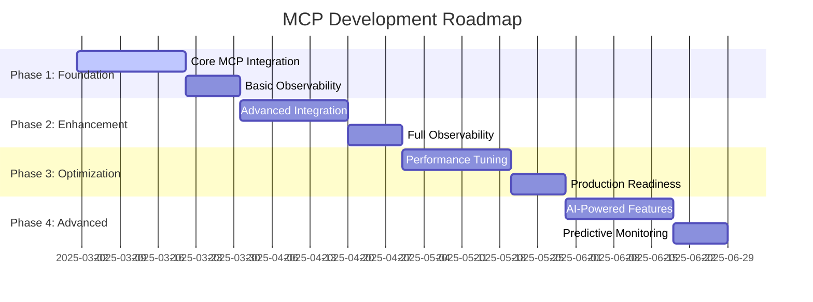
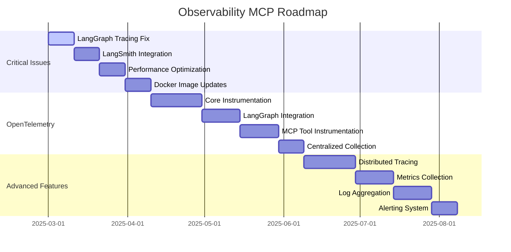

# 🗺️ **MCP ROADMAPS INDEX**

**Version:** 3.0.0  
**Last Updated:** September 6, 2025  
**Status:** ✅ **MCP ROADMAPS COMPLETE**

---

## 🎯 **MCP ROADMAPS OVERVIEW**

This folder contains comprehensive development roadmaps for Model Context Protocol (MCP) integration, observability, and system evolution in the Data Vault Obsidian system.

### **Roadmap Categories**

1. **Development Roadmaps** - Strategic development planning
2. **Observability Roadmaps** - Observability implementation strategy
3. **Integration Roadmaps** - Integration planning and execution
4. **Performance Roadmaps** - Performance optimization strategy

---

## 📚 **ROADMAP DOCUMENTATION**

### **🚀 Development Roadmaps**

#### **[MCP Development Roadmap](MCP_DEVELOPMENT_ROADMAP.md)**
- **Strategic Overview** - Comprehensive MCP development strategy
- **Implementation Phases** - 4-phase implementation plan (20 weeks)
- **Success Metrics** - Clear performance and quality targets
- **Resource Planning** - Team and resource allocation
- **Risk Management** - Risk identification and mitigation strategies

**Key Features:**
- Complete MCP ecosystem development
- Integration with LangGraph and LangSmith
- Performance optimization strategy
- Security and compliance planning
- Production readiness roadmap

### **📊 Observability Roadmaps**

#### **[Observability MCP Roadmap](OBSERVABILITY_MCP_ROADMAP.md)**
- **Observability Strategy** - Comprehensive observability implementation
- **Critical Issues Resolution** - LangGraph tracing and LangSmith integration fixes
- **OpenTelemetry Implementation** - Complete instrumentation strategy
- **Docker Image Optimization** - Enhanced Docker images with observability
- **Advanced Observability** - AI-powered analysis and predictive monitoring

**Key Features:**
- LangGraph thread collection fixes
- LangSmith authentication resolution
- OpenTelemetry instrumentation
- Distributed tracing implementation
- Performance optimization strategy

---

## 🏗️ **ROADMAP ARCHITECTURE**

### **Development Roadmap Timeline**

### **Observability Roadmap Timeline**

---

## 🎯 **ROADMAP IMPLEMENTATION GUIDE**

### **Getting Started with Roadmaps**

1. **Review Strategic Overview**
   - Read [MCP Development Roadmap](MCP_DEVELOPMENT_ROADMAP.md)
   - Understand the 4-phase implementation plan
   - Identify current phase and next steps

2. **Address Critical Issues**
   - Read [Observability MCP Roadmap](OBSERVABILITY_MCP_ROADMAP.md)
   - Focus on critical issues resolution
   - Implement immediate fixes

3. **Plan Implementation**
   - Follow the detailed implementation phases
   - Track progress against success metrics
   - Adjust timeline based on resource availability

### **Roadmap Selection Guide**

| Current State | Recommended Roadmap | Focus Area |
|---------------|-------------------|------------|
| **Starting MCP Integration** | MCP Development Roadmap | Phase 1: Foundation |
| **Experiencing Observability Issues** | Observability MCP Roadmap | Critical Issues Resolution |
| **Ready for Advanced Features** | MCP Development Roadmap | Phase 4: Advanced |
| **Need Performance Optimization** | Observability MCP Roadmap | Performance Optimization |

---

## 📊 **ROADMAP SUCCESS METRICS**

### **Development Roadmap Metrics**
- **Phase Completion Rate:** > 95%
- **Timeline Adherence:** > 90%
- **Quality Targets:** > 99%
- **Resource Utilization:** > 85%

### **Observability Roadmap Metrics**
- **Critical Issues Resolved:** 100%
- **Observability Coverage:** > 95%
- **Performance Improvement:** > 30%
- **Error Detection Accuracy:** > 90%

---

## 🚀 **IMPLEMENTATION PHASES**

### **Phase 1: Foundation (Weeks 1-5)**
1. **Core MCP Integration** - Basic MCP server setup
2. **Tool Registry** - Dynamic tool management
3. **Service Discovery** - Automatic server detection
4. **Basic Observability** - Essential monitoring setup

### **Phase 2: Enhancement (Weeks 6-10)**
1. **Advanced Integration** - Complex MCP patterns
2. **Tool Composition** - Multi-tool operations
3. **Full Observability** - Comprehensive monitoring
4. **Performance Monitoring** - Real-time metrics

### **Phase 3: Optimization (Weeks 11-15)**
1. **Performance Tuning** - System optimization
2. **Error Handling** - Advanced error management
3. **Production Readiness** - Production deployment
4. **Security Hardening** - Security implementation

### **Phase 4: Advanced (Weeks 16-20)**
1. **AI-Powered Features** - Intelligent automation
2. **Predictive Monitoring** - Proactive issue detection
3. **Advanced Correlation** - Cross-service analysis
4. **Continuous Optimization** - Ongoing improvement

---

## 🔗 **RELATED DOCUMENTATION**

### **MCP Documentation**
- **[MCP Documentation Hub](../README.md)** - Main MCP documentation
- **[MCP Patterns Index](../patterns/README.md)** - Implementation patterns
- **[MCP Analysis](../analysis/)** - Technical analysis reports

### **Architecture Documentation**
- **[Architecture Overview](../../architecture/ARCHITECTURE_OVERVIEW.md)** - Main system architecture
- **[Architecture Patterns Index](../../architecture/ARCHITECTURE_PATTERNS_INDEX.md)** - Complete pattern library

### **Integration Guides**
- **[MCP Integration Guide](../guides/MCP_INTEGRATION_GUIDE.md)** - Step-by-step integration guide

---

## 🎯 **NEXT STEPS**

### **Immediate Actions**
1. **Review Current Roadmaps** - Understand implementation strategy
2. **Assess Current State** - Identify current phase and issues
3. **Plan Next Phase** - Prepare for next implementation phase
4. **Allocate Resources** - Ensure adequate resources for implementation

### **Short-term Goals**
1. **Execute Current Phase** - Implement current phase objectives
2. **Monitor Progress** - Track progress against success metrics
3. **Address Issues** - Resolve any implementation issues
4. **Prepare Next Phase** - Plan for next phase implementation

### **Long-term Vision**
1. **Complete All Phases** - Execute all roadmap phases
2. **Achieve Success Metrics** - Meet all performance targets
3. **Continuous Improvement** - Ongoing optimization and enhancement
4. **Ecosystem Evolution** - Evolve MCP ecosystem based on learnings

---

## 📞 **ROADMAP SUPPORT**

### **Implementation Support**
- Follow the detailed implementation guides in each roadmap
- Use the success metrics to track progress
- Adjust timelines based on resource availability
- Document lessons learned for future improvements

### **Issue Resolution**
- Report roadmap implementation issues
- Include relevant documentation references
- Provide detailed technical information
- Collaborate on solution development

### **Contribution**
- Suggest roadmap improvements
- Share implementation experiences
- Contribute to success metrics refinement
- Help with documentation updates

---

**Last Updated:** September 6, 2025  
**MCP Roadmaps Version:** 3.0.0  
**Status:** ✅ **MCP ROADMAPS COMPLETE**

**MCP ROADMAPS INDEX COMPLETE!**
