# 🤖 Interactive CLI

<div align="center">


</div>

---

## 📋 Table of Contents

- [🎯 Overview](#-overview)
- [🚀 Getting Started](#-getting-started)
- [💬 Command Reference](#-command-reference)
- [🔧 Advanced Usage](#-advanced-usage)
- [📊 CLI Architecture](#-cli-architecture)
- [🎨 User Interface](#-user-interface)
- [🔍 Tool Discovery](#-tool-discovery)
- [❌ Error Handling](#-error-handling)
- [🚨 Troubleshooting](#-troubleshooting)

---

## 🎯 Overview

The Interactive CLI provides a **natural language interface** for interacting with the MCP server. It allows users to perform complex operations using simple, conversational commands.

### ✨ CLI Features

| Feature | Description | Status |
|---------|-------------|--------|
| **Natural Language** | Type commands in plain English | ✅ Working |
| **Real-time Responses** | Instant feedback from server | ✅ Working |
| **Tool Discovery** | Auto-discover available tools | ✅ Working |
| **Error Handling** | Graceful error messages | ✅ Working |
| **Command History** | Navigate through previous commands | ✅ Working |
| **Auto-completion** | Tab completion for commands | ✅ Working |

### 🎯 Supported Commands

| Command Type | Examples | Description |
|--------------|----------|-------------|
| **File Operations** | "list files", "read note AGENTS.md" | File management |
| **Search Operations** | "search for test", "find matematica" | Content search |
| **Note Creation** | "create note", "new note" | Note creation |
| **Analysis** | "analyze links", "show connections" | Link analysis |
| **System Commands** | "/help", "/status", "/quit" | System operations |

---

## 🚀 Getting Started

### ⚡ Quick Start

```bash
# Start the Interactive CLI
.\INTERACTIVE_CLI.bat

# Or start everything (server + CLI)
.\START_EVERYTHING.bat
```

### 🎯 First Steps

1. **Start the CLI** - Run the interactive CLI script
2. **Check Status** - Type `/status` to verify connection
3. **List Tools** - Type `/tools` to see available tools
4. **Try Commands** - Start with "list files" or "search for test"

### 💬 Example Session

```bash
🤖 MCP Server Interactive CLI Chat
==================================
Welcome! I'm your AI assistant connected to the MCP server.
I can help you interact with your Obsidian vault using various tools.

Available commands:
  /help     - Show this help message
  /tools    - List available MCP tools
  /status   - Check server status
  /quit     - Exit the chat

You can also ask me to:
  - List files in your vault
  - Search for specific content
  - Read notes
  - Create new notes
  - Analyze links between notes
  - And much more!

Type your message and press Enter to start chatting...

🤖 You: list files
📁 Listing files in your vault...
✅ Success!
📊 Result:
[
  {
    "name": "AGENTS.md",
    "path": "AGENTS.md",
    "type": "file"
  },
  {
    "name": "--METAS",
    "path": "--METAS",
    "type": "folder"
  }
]
💬 Message: Found 69 files

🤖 You: search for test
🔍 Searching for: test
✅ Success!
💬 Message: Found 0 results for 'test'

🤖 You: read note AGENTS.md
📖 Reading note: AGENTS.md
✅ Success!
💬 Message: Note read successfully
```

---

## 💬 Command Reference

### 🏠 System Commands

| Command | Description | Example |
|---------|-------------|---------|
| `/help` | Show help message | `/help` |
| `/tools` | List available tools | `/tools` |
| `/status` | Check server status | `/status` |
| `/quit` | Exit the CLI | `/quit` |

### 📁 File Operations

| Command | Description | Example |
|---------|-------------|---------|
| `list files` | List all files in vault | `list files` |
| `read note [filename]` | Read specific note | `read note AGENTS.md` |
| `show files` | Alternative to list files | `show files` |
| `display [filename]` | Alternative to read note | `display AGENTS.md` |

### 🔍 Search Operations

| Command | Description | Example |
|---------|-------------|---------|
| `search for [query]` | Search vault content | `search for test` |
| `find [query]` | Alternative search command | `find matematica` |
| `look for [query]` | Another search variant | `look for logica` |
| `semantic search for [query]` | AI-powered search | `semantic search for AI` |

### ✏️ Note Creation

| Command | Description | Example |
|---------|-------------|---------|
| `create note` | Create new note | `create note` |
| `new note` | Alternative creation | `new note` |
| `add note` | Another variant | `add note` |

### 🔗 Analysis Operations

| Command | Description | Example |
|---------|-------------|---------|
| `analyze links` | Analyze note relationships | `analyze links` |
| `show connections` | Show note connections | `show connections` |
| `link analysis` | Alternative analysis | `link analysis` |

---

## 🔧 Advanced Usage

### 🎯 Command Patterns

The CLI supports various command patterns and synonyms:

<details>
<summary>📁 <strong>File Operation Patterns</strong></summary>

```bash
# List files variations
list files
show files
display files
get files
files list

# Read note variations
read note AGENTS.md
read AGENTS.md
show AGENTS.md
display AGENTS.md
open AGENTS.md
view AGENTS.md
```

</details>

<details>
<summary>🔍 <strong>Search Patterns</strong></summary>

```bash
# Search variations
search for test
search test
find test
look for test
seek test
query test

# Semantic search variations
semantic search for AI
semantic find AI
AI search
find similar to AI
```

</details>

<details>
<summary>✏️ <strong>Creation Patterns</strong></summary>

```bash
# Note creation variations
create note
new note
add note
make note
write note
generate note
```

</details>

### 🔧 Parameter Handling

The CLI intelligently extracts parameters from natural language:

```bash
# These commands are equivalent:
read note AGENTS.md
read AGENTS.md
show AGENTS.md
display AGENTS.md

# Search with context:
search for artificial intelligence
find content about AI
look for machine learning
```

### 📊 Response Formatting

The CLI provides formatted responses with:

- **Status Indicators** - ✅ Success, ❌ Error
- **Action Descriptions** - 📁 Listing, 🔍 Searching, etc.
- **Structured Results** - Formatted JSON output
- **Human Messages** - Friendly status messages

---

## 📊 CLI Architecture

### 🏗️ CLI Structure

```mermaid
graph TB
    subgraph "Interactive CLI"
        CLI[🤖 CLI Interface]
        PARSER[📝 Command Parser]
        HANDLER[⚙️ Command Handler]
        FORMATTER[🎨 Response Formatter]
    end
    
    subgraph "MCP Server"
        SERVER[🚀 MCP Server]
        TOOLS[🛠️ Tool Registry]
        API[🌐 REST API]
    end
    
    subgraph "User Interface"
        INPUT[⌨️ User Input]
        OUTPUT[📺 Formatted Output]
        HISTORY[📚 Command History]
    end
    
    INPUT --> CLI
    CLI --> PARSER
    PARSER --> HANDLER
    HANDLER --> SERVER
    SERVER --> TOOLS
    TOOLS --> API
    API --> HANDLER
    HANDLER --> FORMATTER
    FORMATTER --> OUTPUT
    
    CLI --> HISTORY
    
    style CLI fill:#e1f5fe,stroke:#01579b,stroke-width:3px
    style PARSER fill:#f3e5f5,stroke:#4a148c,stroke-width:2px
    style HANDLER fill:#e8f5e8,stroke:#1b5e20,stroke-width:2px
    style SERVER fill:#fff3e0,stroke:#e65100,stroke-width:2px
```



### 🔄 Command Flow


---

## 🎨 User Interface

### 🖥️ Interface Elements

| Element | Description | Example |
|---------|-------------|---------|
| **Welcome Banner** | Initial greeting and instructions | `🤖 MCP Server Interactive CLI Chat` |
| **Command Prompt** | User input prompt | `🤖 You: ` |
| **Action Indicators** | Visual action indicators | `📁 Listing`, `🔍 Searching` |
| **Status Icons** | Success/error indicators | `✅ Success!`, `❌ Error!` |
| **Result Display** | Formatted results | Structured JSON output |
| **Message Text** | Human-readable messages | `Found 69 files` |

### 🎯 Visual Design

```bash
🤖 MCP Server Interactive CLI Chat
==================================
Welcome! I'm your AI assistant connected to the MCP server.

Available commands:
  /help     - Show this help message
  /tools    - List available MCP tools
  /status   - Check server status
  /quit     - Exit the chat

You can also ask me to:
  - List files in your vault
  - Search for specific content
  - Read notes
  - Create new notes
  - Analyze links between notes
  - And much more!

Type your message and press Enter to start chatting...

🤖 You: [USER INPUT]
```

### 🎨 Response Formatting

The CLI formats responses with:

- **Emojis** - Visual indicators for different actions
- **Colors** - Status-based color coding
- **Indentation** - Structured output formatting
- **Sections** - Clear separation of different response parts

---

## 🔍 Tool Discovery

### 📋 Available Tools

The CLI automatically discovers and provides access to all available MCP tools:

| Tool | CLI Command | Description |
|------|-------------|-------------|
| `list_files_in_vault` | `list files` | Lists all files in vault |
| `read_note` | `read note [filename]` | Reads specific note |
| `search_vault` | `search for [query]` | Searches vault content |
| `semantic_search` | `semantic search for [query]` | AI-powered search |
| `create_note` | `create note` | Creates new note |
| `bulk_tag` | `tag [files] with [tags]` | Applies tags to notes |
| `analyze_links` | `analyze links` | Analyzes note relationships |

### 🔧 Tool Mapping


---

## ❌ Error Handling

### 🚨 Error Types

| Error Type | Description | Example |
|------------|-------------|---------|
| **Connection Error** | Cannot connect to server | `❌ Failed to connect to server` |
| **Tool Not Found** | Unknown command | `❌ Unknown command: 'invalid'` |
| **Parameter Error** | Missing or invalid parameters | `❌ Missing filename parameter` |
| **Server Error** | Server-side error | `❌ Server error: Tool execution failed` |

### 🔧 Error Recovery

The CLI provides helpful error recovery:

```bash
🤖 You: invalid command
❌ Unknown command: 'invalid command'
💡 Try one of these:
  - 'list files' - List all files in your vault
  - 'search for [query]' - Search your vault
  - 'read note [filename]' - Read a specific note
  - 'create note' - Create a new note
  - 'analyze links' - Analyze note connections
  - '/help' - Show help

🤖 You: read note
❌ Missing filename parameter
💡 Usage: read note [filename]
   Example: read note AGENTS.md

🤖 You: read note AGENTS.md
📖 Reading note: AGENTS.md
✅ Success!
💬 Message: Note read successfully
```

---

## 🚨 Troubleshooting

### ❌ Common Issues

<details>
<summary>🔧 <strong>Connection Issues</strong></summary>

**Problem:** CLI cannot connect to server
**Symptoms:** Connection refused, timeout errors
**Solutions:**
1. Ensure MCP server is running (`go run cmd/server/main.go`)
2. Check server is listening on port 3010
3. Verify server health (`curl http://localhost:3010/health`)
4. Check firewall settings

</details>

<details>
<summary>🔧 <strong>Command Recognition Issues</strong></summary>

**Problem:** Commands not recognized
**Symptoms:** "Unknown command" errors
**Solutions:**
1. Use exact command patterns (e.g., "list files")
2. Check available commands with `/tools`
3. Use `/help` for command reference
4. Try alternative command variations

</details>

<details>
<summary>🔧 <strong>Parameter Issues</strong></summary>

**Problem:** Missing or invalid parameters
**Symptoms:** Parameter validation errors
**Solutions:**
1. Provide required parameters (e.g., filename for read note)
2. Use correct parameter format
3. Check parameter examples in help
4. Use quoted strings for complex parameters

</details>

<details>
<summary>🔧 <strong>Response Formatting Issues</strong></summary>

**Problem:** Malformed responses
**Symptoms:** JSON parsing errors, display issues
**Solutions:**
1. Check server response format
2. Verify tool execution success
3. Check for server errors
4. Restart CLI if persistent issues

</details>

### 🔍 Debugging Commands

| Command | Purpose | Usage |
|---------|---------|-------|
| `/status` | Check server connection | `/status` |
| `/tools` | List available tools | `/tools` |
| `/help` | Show command reference | `/help` |

### 🧪 Testing Commands

```bash
# Test basic connectivity
/status

# Test tool discovery
/tools

# Test file operations
list files

# Test search functionality
search for test

# Test note reading
read note AGENTS.md
```

---

## 🎯 Best Practices

### 💡 Usage Tips

1. **Use Natural Language** - Type commands as you would speak them
2. **Be Specific** - Provide clear parameters (e.g., exact filenames)
3. **Check Status** - Use `/status` to verify server connection
4. **Explore Tools** - Use `/tools` to discover available functionality
5. **Use Help** - Use `/help` for command reference

### 🚀 Performance Tips

1. **Cache Results** - Server caches responses for faster subsequent requests
2. **Batch Operations** - Use bulk operations when possible
3. **Specific Searches** - Use specific search terms for better results
4. **File Names** - Use exact file names for read operations

---

## 🎯 Advanced Features

### 🔧 Custom Commands

The CLI supports custom command patterns:

```bash
# Custom file operations
show me all files
display the file list
get the vault contents

# Custom search operations
find everything about AI
look for machine learning content
search for technical documentation

# Custom analysis operations
show me the connections
analyze the relationships
map the note links
```

### 📊 Response Customization

The CLI provides customizable response formatting:

- **Verbose Mode** - Detailed response information
- **Compact Mode** - Minimal response format
- **JSON Mode** - Raw JSON response format
- **Table Mode** - Tabular response format

---

<div align="center">

**🤖 Interactive CLI Documentation Complete! 🤖**

[](#)
[](#)
[](#)

**CENTRALIZED REPORTS & CHANGELOG SYSTEM COMPLETE!**

</div>
