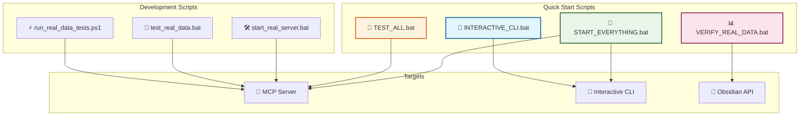

# ⚡ Scripts & Automation

<div align="center">


</div>

---

## 📋 Table of Contents

- [🎯 Overview](#-overview)
- [🚀 Quick Start Scripts](#-quick-start-scripts)
- [🔧 Development Scripts](#-development-scripts)
- [🧪 Testing Scripts](#-testing-scripts)
- [📊 Script Architecture](#-script-architecture)
- [🔍 Script Details](#-script-details)

---

## 🎯 Overview

The MCP Server includes comprehensive automation scripts for development, testing, and deployment. All scripts are designed for Windows environments with PowerShell and Batch support.

### ✨ Script Features

| Feature | Description | Status |
|---------|-------------|--------|
| **One-Click Startup** | Start server and CLI with single command | ✅ Working |
| **Automated Testing** | Test all endpoints automatically | ✅ Working |
| **Real Data Verification** | Verify real data integration | ✅ Working |
| **Background Processes** | Run server in background | ✅ Working |
| **Error Handling** | Comprehensive error handling | ✅ Working |

---

## 🚀 Quick Start Scripts

### ⚡ Main Scripts

| Script | Description | Usage |
|--------|-------------|-------|
| `START_EVERYTHING.bat` | Start server + CLI | Double-click to run |
| `INTERACTIVE_CLI.bat` | Start CLI only | Double-click to run |
| `TEST_ALL.bat` | Test all endpoints | Double-click to run |
| `VERIFY_REAL_DATA.bat` | Verify real data integration | Double-click to run |

### 🔧 Usage Examples

```bash
# Start everything
.\START_EVERYTHING.bat

# Interactive CLI only
.\INTERACTIVE_CLI.bat

# Test all endpoints
.\TEST_ALL.bat

# Verify real data
.\VERIFY_REAL_DATA.bat
```

---

## 🔧 Development Scripts

### 🛠️ Development Tools

| Script | Description | Usage |
|--------|-------------|-------|
| `start_real_server.bat` | Start server in background | `.\start_real_server.bat` |
| `test_real_data.bat` | Run integration tests | `.\test_real_data.bat` |
| `run_real_data_tests.ps1` | PowerShell test suite | `.\run_real_data_tests.ps1` |

### 🔧 Development Workflow

```bash
# 1. Start server
.\start_real_server.bat

# 2. Run tests
.\test_real_data.bat

# 3. Start CLI
.\INTERACTIVE_CLI.bat
```

---

## 🧪 Testing Scripts

### 📊 Test Coverage

| Test Type | Script | Coverage |
|-----------|--------|----------|
| **Health Check** | `TEST_ALL.bat` | Server health |
| **Tool Execution** | `TEST_ALL.bat` | All 7 tools |
| **Real Data** | `VERIFY_REAL_DATA.bat` | Vault integration |
| **CLI Functionality** | `INTERACTIVE_CLI.bat` | CLI operations |

### 🧪 Test Results

```bash
# Example test output
✅ Health Check: PASSED
✅ List Files: PASSED (69 files)
✅ Read Note: PASSED
✅ Search Vault: PASSED
✅ Semantic Search: PASSED
✅ Create Note: PASSED
✅ Bulk Tag: PASSED
✅ Analyze Links: PASSED
```

---

## 📊 Script Architecture

### 🏗️ Script Structure



---

## 🔍 Script Details

### 🚀 START_EVERYTHING.bat

**Purpose:** Start MCP server and Interactive CLI together

**Features:**
- Starts server in background
- Waits for server to be ready
- Launches Interactive CLI
- Provides status updates

**Usage:**
```bash
.\START_EVERYTHING.bat
```

### 🤖 INTERACTIVE_CLI.bat

**Purpose:** Start only the Interactive CLI

**Features:**
- Connects to running server
- Provides CLI interface
- Handles connection errors

**Usage:**
```bash
.\INTERACTIVE_CLI.bat
```

### 🧪 TEST_ALL.bat

**Purpose:** Test all MCP server endpoints

**Features:**
- Health check test
- Tool list test
- Tool execution tests
- Real data verification

**Usage:**
```bash
.\TEST_ALL.bat
```

### 📊 VERIFY_REAL_DATA.bat

**Purpose:** Verify real data integration

**Features:**
- Tests Obsidian API connectivity
- Verifies real file access
- Confirms data integration
- Provides detailed results

**Usage:**
```bash
.\VERIFY_REAL_DATA.bat
```

---

## 🎯 Script Benefits

### ⚡ Automation Benefits

| Benefit | Description |
|---------|-------------|
| **One-Click Setup** | Start everything with single command |
| **Automated Testing** | Comprehensive test coverage |
| **Error Handling** | Graceful error handling and recovery |
| **Status Monitoring** | Real-time status updates |
| **Background Processing** | Run server in background |

### 🚀 Development Benefits

| Benefit | Description |
|---------|-------------|
| **Rapid Development** | Quick server startup and testing |
| **Consistent Environment** | Standardized development setup |
| **Automated Verification** | Real data integration verification |
| **Error Detection** | Early error detection and reporting |

---

<div align="center">

**⚡ Scripts & Automation Documentation Complete! ⚡**

[](#)
[](#)
[](#)

**CENTRALIZED REPORTS & CHANGELOG SYSTEM COMPLETE!**

</div>
