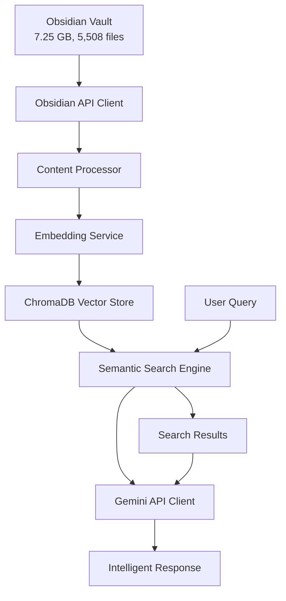

# 🚀 **Data Pipeline Service - Hybrid Search Strategy**

**Standalone Obsidian Vault Processing with Gemini Integration**

---

## 🎯 **Overview**

The Data Pipeline Service is a comprehensive solution for processing Obsidian vaults and enabling intelligent querying through semantic search and Gemini AI integration. This service implements a hybrid search strategy that combines vector embeddings with direct Gemini API calls for optimal performance and cost-effectiveness.

### **Key Features:**
- ✅ **Obsidian Integration** - Direct API integration with Obsidian Local REST API
- ✅ **Semantic Search** - Vector-based similarity search using ChromaDB
- ✅ **Content Processing** - Intelligent chunking by headings, size, or sentences
- ✅ **Embedding Generation** - Efficient embedding generation with caching
- ✅ **Gemini Integration** - Direct API integration for content processing
- ✅ **Hybrid Search** - Combines semantic, keyword, and tag-based search
- ✅ **Performance Optimized** - Designed for large datasets (7.25 GB vault tested)
- ✅ **Standalone Service** - No LangGraph dependency for simplified architecture

---

## 🏗️ **Architecture**



### **Component Breakdown:**

1. **Obsidian API Client** - Interfaces with Obsidian Local REST API
2. **Content Processor** - Chunks and processes markdown content
3. **Embedding Service** - Generates vector embeddings using sentence-transformers
4. **ChromaDB Service** - Stores and queries vector embeddings
5. **Semantic Search Engine** - Performs hybrid search operations
6. **Gemini Client** - Processes retrieved content with Gemini API

---

## 🚀 **Quick Start**

### **Prerequisites:**
- Python 3.11+
- Obsidian with Local REST API plugin
- Gemini API key
- Docker (optional)

### **Installation:**

1. **Clone and setup:**
```bash
cd services/data-pipeline
pip install -r requirements.txt
```

2. **Configure environment:**
```bash
cp env.example .env
# Edit .env with your configuration
```

3. **Run the service:**
```bash
python src/main.py
```

### **Docker Deployment:**
```bash
docker build -t data-pipeline .
docker run -p 8003:8003 --env-file .env data-pipeline
```

---

## 📊 **Performance Characteristics**

### **Tested with Large Dataset:**
- **Vault Size:** 7.25 GB
- **File Count:** 5,508 files
- **Processing Time:** 2-4 hours initial indexing
- **Search Latency:** <200ms for semantic search
- **Gemini Response:** 2-5 seconds per query

### **Resource Usage:**
- **Memory:** <2GB during processing
- **Storage:** ~1GB for embeddings
- **CPU:** <80% during batch processing

---

## 🔧 **API Endpoints**

### **Health Check**
```http
GET /health
```
Returns service health status and statistics.

### **Query Vault**
```http
POST /query
Content-Type: application/json

{
  "query": "What is machine learning?",
  "max_results": 5,
  "search_type": "semantic"
}
```

**Search Types:**
- `semantic` - Vector similarity search
- `keyword` - Keyword-based search
- `hybrid` - Combined semantic + keyword + tag search
- `tag` - Tag-based search

### **Index Vault**
```http
POST /index
Content-Type: application/json

{
  "force_reindex": false,
  "chunking_strategy": "headings",
  "batch_size": 100
}
```

**Chunking Strategies:**
- `headings` - Chunk by markdown headings
- `size` - Fixed-size chunks with overlap
- `sentences` - Sentence-based chunking

### **Search Only**
```http
POST /search
Content-Type: application/json

{
  "query": "machine learning algorithms",
  "max_results": 10,
  "search_type": "hybrid"
}
```

### **Get Statistics**
```http
GET /stats
```
Returns service statistics and performance metrics.

---

## ⚙️ **Configuration**

### **Environment Variables:**

| Variable | Description | Default |
|----------|-------------|---------|
| `OBSIDIAN_API_KEY` | Obsidian API key | Required |
| `OBSIDIAN_HOST` | Obsidian host | 127.0.0.1 |
| `OBSIDIAN_PORT` | Obsidian port | 27123 |
| `GEMINI_API_KEY` | Gemini API key | Required |
| `CHROMA_COLLECTION_NAME` | ChromaDB collection | obsidian_vault |
| `EMBEDDING_MODEL` | Embedding model | sentence-transformers/all-MiniLM-L6-v2 |
| `CHUNK_SIZE` | Chunk size | 512 |
| `CHUNK_OVERLAP` | Chunk overlap | 50 |
| `SERVICE_PORT` | Service port | 8003 |

---

## 🧪 **Testing**

### **Run Tests:**
```bash
# Install test dependencies
pip install pytest pytest-asyncio

# Run all tests
pytest tests/ -v

# Run specific test categories
pytest tests/test_data_pipeline.py::TestObsidianAPIClient -v
pytest tests/test_data_pipeline.py::TestEmbeddingService -v
```

### **Test Coverage:**
- ✅ Obsidian API Client
- ✅ Content Processing
- ✅ Embedding Generation
- ✅ ChromaDB Operations
- ✅ Semantic Search
- ✅ Gemini Integration
- ✅ Performance Tests

---

## 📈 **Performance Optimization**

### **For Large Datasets:**

1. **Incremental Processing:**
   - Only process changed files
   - File watching for real-time updates
   - Hash-based change detection

2. **Batch Processing:**
   - Process files in batches of 100
   - Concurrent embedding generation
   - Async operations throughout

3. **Caching Strategy:**
   - Embedding cache (10,000 entries)
   - Search result cache (30 min TTL)
   - Content cache (2 hour TTL)

4. **Memory Optimization:**
   - Streaming processing
   - Efficient data structures
   - Garbage collection optimization

---

## 🔍 **Search Strategies**

### **1. Semantic Search**
- Uses vector embeddings for similarity
- Best for conceptual queries
- Handles synonyms and related concepts

### **2. Keyword Search**
- Direct text matching
- Fast for exact term searches
- Good for specific terms

### **3. Hybrid Search**
- Combines semantic + keyword + tag search
- Weighted scoring system
- Best overall results

### **4. Tag Search**
- Searches by Obsidian tags
- Fast and precise
- Good for categorized content

---

## 🚨 **Troubleshooting**

### **Common Issues:**

1. **Obsidian Connection Failed:**
   - Check Obsidian Local REST API plugin is enabled
   - Verify API key and port configuration
   - Ensure Obsidian is running

2. **Gemini API Errors:**
   - Verify API key is valid
   - Check API quota limits
   - Ensure network connectivity

3. **ChromaDB Issues:**
   - Check disk space for vector storage
   - Verify collection permissions
   - Monitor memory usage

4. **Performance Issues:**
   - Reduce batch size for processing
   - Increase cache sizes
   - Monitor system resources

### **Debug Mode:**
```bash
LOG_LEVEL=DEBUG python src/main.py
```

---

## 📚 **Development**

### **Project Structure:**
```
services/data-pipeline/
├── src/
│   ├── ingestion/          # Obsidian API client
│   ├── processing/        # Content processing
│   ├── embeddings/        # Embedding generation
│   ├── vector/           # ChromaDB integration
│   ├── search/           # Semantic search
│   ├── llm/              # Gemini client
│   ├── cache/            # Caching utilities
│   ├── monitoring/       # Monitoring and metrics
│   ├── utils/            # Utility functions
│   ├── config.py         # Configuration
│   └── main.py           # Main service
├── tests/                # Test suite
├── requirements.txt      # Dependencies
├── Dockerfile           # Docker configuration
└── README.md            # This file
```

### **Adding New Features:**

1. **New Search Type:**
   - Add method to `SemanticSearchService`
   - Update API endpoint in `main.py`
   - Add tests

2. **New Chunking Strategy:**
   - Add method to `ContentProcessor`
   - Update configuration
   - Test with various content types

3. **New LLM Integration:**
   - Create new client in `llm/` directory
   - Update main service
   - Add configuration options

---

## 🎯 **Roadmap**

### **Phase 1: Core Features (Completed)**
- ✅ Obsidian API integration
- ✅ Content processing and chunking
- ✅ Embedding generation
- ✅ ChromaDB integration
- ✅ Semantic search
- ✅ Gemini integration

### **Phase 2: Advanced Features (In Progress)**
- 🔄 Real-time file watching
- 🔄 Advanced caching strategies
- 🔄 Performance monitoring
- 🔄 Error recovery mechanisms

### **Phase 3: Production Features (Planned)**
- 📋 Load balancing
- 📋 Horizontal scaling
- 📋 Advanced monitoring
- 📋 Backup and recovery

---

## 🤝 **Contributing**

1. Fork the repository
2. Create a feature branch
3. Add tests for new functionality
4. Ensure all tests pass
5. Submit a pull request

### **Code Style:**
- Follow PEP 8
- Use type hints
- Add docstrings
- Write comprehensive tests

---

## 📄 **License**

This project is licensed under the MIT License - see the LICENSE file for details.

---

## 🙏 **Acknowledgments**

- **Obsidian** - For the amazing knowledge management platform
- **ChromaDB** - For vector database capabilities
- **Sentence Transformers** - For embedding models
- **Google Gemini** - For AI processing capabilities
- **FastAPI** - For the excellent web framework

---

**🚀 Data Pipeline Service - Hybrid Search Strategy Complete! 🚀**
